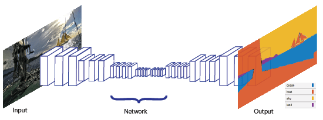

## Autoencoder Definition

Autoencoder: **Encoder** (aka `backbone`) plus **Decoder** (aka `head`) together.

- **Encoder** projects input down to a lower dimension (i.e. compression).
- **Decoder** tries to replicate the original input (image) as close as possible (i.e. decompression).

### Example: Anomaly detection:

1. **Training**: Train autoencoder to reconstruct image as close to real one as possible.

    - Thereby the image is first broken down into lower-dimensional features
    - ..and then reconstructed again.

2. **Test (and Validate)**: Use autoencoder to reconstruct unseen image.

    - If we get a higher error (i.e. an image is hard to reconstruct) the input image is likely quite different than the images used for training (aka out of distribution). Thus, this image might be an anomaly.
    - Use error as ranking of how different the test image is compared to the images trained on (set threshold to define an anomaly)

### Example: Semantic segmentation

#### Setup

- "Classes" is equivalent to "Labels", i.e. each color in image segmentation is a label.
- Input image (x, y, 3) dimensions gets mapped onto (x, y, classes) dimensions where 
- (x, y): width and height of image: values in range [0, 255].
- classes: number of classes (colors) in range [0, 1] (no sigmoid function run)

Input image dimensions [x, x, 3] (`width`, `height`, `dimensions`)

    x: {0-255}

Output image dimensions [x, x, #classes]

    #classes: {0,1}

#### Training

1. **Training**: Decompose image (reduce complexity of image a lot to extract features which have a meaning, e.g. faces in a photo) and re-create image in two dimensions (two colors).
2. **Test and Validation**: Run new image through autoencoder.

#### Coloring of Segementation map

- Running **softmax** on the output layer reduces dimensions to 1 because a "winner" color is chosen for each (x, y) pixel in image. This way we get the colored semantic segementation images. 

**Note**: This is pixel **regression** (not classification). We map the range `[0, 255]` onto the range `[0, 1]`.

---

**But**: Pre-trained models are still more powerful.

**NB**: There are more connections

See also [this kaggle Notebook about image segementation](https://www.kaggle.com/dhananjay3/image-segmentation-from-scratch-in-pytorch).

- [The Oxford-IIIT Pet Dataset ](https://www.robots.ox.ac.uk/~vgg/data/pets/) offers nicely annotated data for an instance segmentation task

---

## Feature extractor

Definitions:
- Everything which is not in output layer is a **feature**
- The nodes in the output layer are called **classes**.

Transfer learning with auto-encoders.

We call an encoder **feature extractor**. 

Thereby we first freeze the encoder and train a classifier. Sometimes the feature extractor is

**Example**:

- 1 epoch train only classifier
- 3 epochs train everything

**NB**: fast ai has some suitable defaults here and it's much less code.

Plus a fully-connected layer as classifier.

**Definition**: The **head** of a neural network is the classifier (located at the end).

---

Autoencoder without decoder: self-supervised learning.