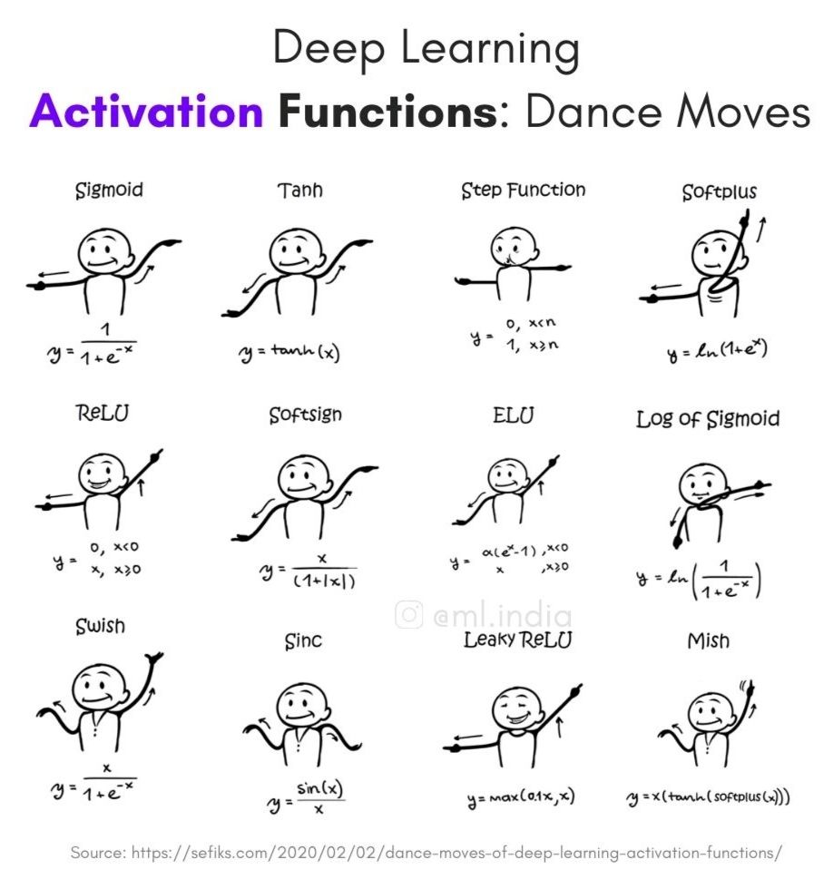
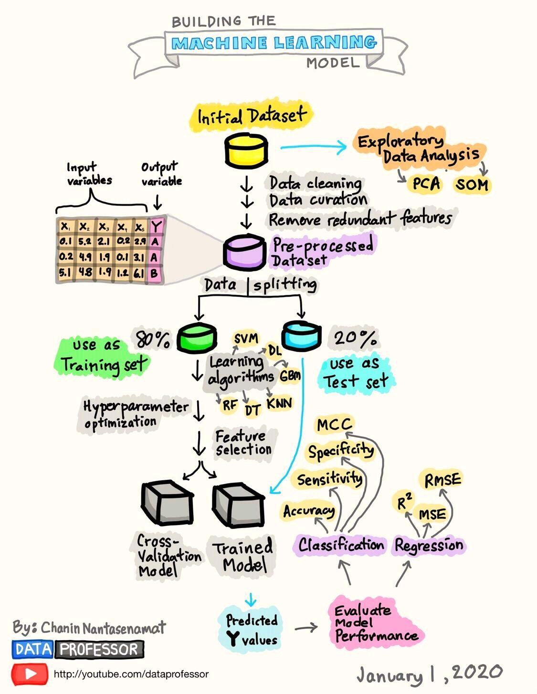

## General concepts

### Papers

Read about current machine learning papers: https://paperswithcode.com/

### Neural Network

Last layer is usually called `L`.

#### Recurrent Neural Networks

- [The Unreasonable Effectiveness of Recurrent Neural Networks](http://karpathy.github.io/2015/05/21/rnn-effectiveness/)
- [Recurrent Neural Networks cheatsheet](https://stanford.edu/~shervine/teaching/cs-230/cheatsheet-recurrent-neural-networks)

##### Machine Learning and Sound

- [Using Deep Learning For Sound Classification: An In-Depth Analysis](https://analyticsindiamag.com/using-deep-learning-for-sound-classification-an-in-depth-analysis/)

#### Reinforcement Learning

- [MIT 6.S091: Introduction to Deep Reinforcement Learning (Deep RL)](https://www.youtube.com/watch?v=zR11FLZ-O9M&list=PLrAXtmErZgOeiKm4sgNOknGvNjby9efdf)

- [Reinforcement Learning algorithms — an intuitive overview](https://medium.com/@SmartLabAI/reinforcement-learning-algorithms-an-intuitive-overview-904e2dff5bbc)

- Article about [Hierarchical Reinforcement Learning](https://thegradient.pub/the-promise-of-hierarchical-reinforcement-learning/)

#### Deep Learning

- [Deep Learning course by Lex Fridman](https://deeplearning.mit.edu/)
- [Deep Learning State of the Art (2020)](https://www.youtube.com/watch?v=0VH1Lim8gL8)

#### Convolutional Neural Network

- [Great fast.ai explanation with Excel](https://mc.ai/convolutional-neural-networks-in-10-steps-lesson-3-fast-ai/)

##### Layers

- **Pooling** layer: Combination of fields via a function (e.g. `MAX_POOLING`) - no parameters to learn
- **Convolutional** layers: Applying a convolution function with weights to learn and update

    - [Here](https://towardsdatascience.com/types-of-convolutions-in-deep-learning-717013397f4d) different convolutional layers are described.

### Activation function



* The [rectifier](https://en.wikipedia.org/wiki/Rectifier_(neural_networks)) is a popular activation function - the positive part of its argument.
> A unit employing the rectifier is also called a **rectified linear unit** (ReLU)

    In pytorch: `res.max(tensor(0.0))` or `F.relu` (plot it: `plot_function(F.relu)`)

Why **ReLU**? - **Vanishing gradient problem**. Easy to compute.

**Leaky** ReLU - instead of 0 for x < 0 -> choose slightly decreasing value


The universal approximation theorem shows that any function can be approximated as closely as needed using just one nonlinearity. So why do we normally use more?

### Mindset

- **Data Science** Mindset

    Prefer ugly pipeline over nicely implemented pipeline

- **Engineering** Mindset

    Build nice pipeline


### [Accuracy / recall tradeoff](https://en.wikipedia.org/wiki/Precision_and_recall#Recall)

**Accuracy/Precision**: Correct vs. total amount of test cases (only works reliably for data sets where classes are well balanced).

- True Positives / (True Positives + False Positives)
- Own words: They really positive ones among the ones you believe are positive.

**Recall**: Ability of a model to find all the relevant cases within a dataset:

- True Positives / (True Positives + False Negatives)
- Own words: They ones successfully found to be positive ones among all the really positive ones (i.e. the ones who should have been found as positive).
- **Note**: False negative: You think it's positive although it's not, i.e. falsly say its negative, e.g. telling someone they don't have cancer although they actually do.
- Can easily be achieved by just labeling all as positive. --> Also need precision.

**F_1 score**: Harmonic mean of recall and precision

- **Formula**: 2 * (precision * recall) / (precision + recall)
- **Note**: Harmonic mean punishes extreme differences between precision and recall

## Confustion matrix

Compare everything in a confusion matrix.

- **True Positive (TP)**: Correctly classified as positive
- **True Negative (TN)**: Correctly classified as negative
- **False Positive (FP)**: Incorrectly classified as positive (I say it's positive although it's not)
- **False Negative (FN)**: Incorrectly classified as negative (I say it's negative although it's not)

### Specificity vs. Sensitivity

- **Specificity**: True Negative Rate

    - **Formula**: TN / All negative cases = TN / (TN + FP)
    - How well can I find the truely negative ones, aka. the irrelevant ones?
    - How well can I rule out the truely negative ones?
    - **Reduce false positives** for a higher specificity.
     

    > "Specificity" is often remembered as "SpPIn" (like **"specifically pinning down"** a disease or condition), as it refers to the proportion of true negative cases that are correctly identified by a test.

    > "Specificity" - "SpPIn" (like "Specificity Pins Down" the true negatives)

- **Sensitivity**: True Positive Rate

    - **Formula**: TP / All positive cases = TP / (TP + FN)
    - How well can I find the truely positive ones, aka. the relevant ones?
    - **Reduce false negatives** for a higher sensitivity.
    > "Sensitivity" is often remembered as "SnNout" (like "sniffing out" a disease or condition), as it refers to the proportion of true positive cases that are correctly identified by a test.]

    > "Sensitivity" - "SeSeize" (like "Sensitivity Seizes" the true positives)

#### Examples

- *🩻 medical test (e.g. cancer screening)* want a high **sensitivity** -> screening tests aim to accurately identify people with cancer, thereby having a high true positive rate - you don't want to miss a person with cancer. Avoidance of false positives (false alarms) is not the main goal - so people who don't have cancer might be falsely identified as having cancer. 
- *✈️ airport security scanners* want high specificity -> they are able to accurately identify non-threat objects (i.e. identify passangers without bombs)
   

### How to choose the right threshold?

> How to decide whether to prefer specificity or sensitivity?

- Decide what is more dangerous: False positive or false negative?
- An airport security scanner is an example for a system where false positives (an actual weapon not detected) are more dangerous than false negatives (stopping a person although they don't have a weapon).

- A medical test is an example for a system where false negatives are more dangerous than false positives.


- **ROC curve**: Plot sensitivity vs. 1 - specificity

    - **Note**: 1 - specificity = false positive rate (FPR) = 1 - TN / (TN + FP)
  
- **AUC**: Area under the ROC curve
    
        - **Note**: AUC = 1: Perfect classifier
        - **Note**: AUC = 0.5: Random classifier


### Data Loader

An iterator which collects the data and makes it ready to be trained by a neural network.


### Understand model

Show what weights are doing.. what does one of the first layers do/emphasize?

```python
show_image(w[2].view(28,28))
```

### Classification

**Exclusive** vs. **non-exclusive** classes.

Use *one-hot-encoding* to encode output layer.

#### Activation functions

How to filter the output value of a neuron before passing it on.

1. Non-exclusive classes

    Use `Sigmoid` activation function

2. Exclusive classes

    * Use `Softmax` activation function to ensure that sum of all classes equals 1.
    * This way you can choose the value with highest probability.

### Gradient descent

- Metric vs. Loss

    - Metric is what we really care about (to communicate result to humans)
    - Loss is smooth function which does not have plateaus or bumps and where you can take a good derivative

    e.g. ...

* Cost/Loss functions

    * Regression problems: **Quadratic cost**
    * Classification problems: **Cross entropy** - model predicts a probablity distribution over all classes.

* Optimized **learning rate**

    * Adaptive gradient descent
    * Optimizer: Adam: A Method for Stochastic Optimization

### Backpropagation

1. How sensitive is cost function to changes in weight matrix `w`?
2. Take partial derivative of cost function with respect to weight `w`.
3. Apply chain-rule to get `dC/dw = dC/da * da/dz * dz/dw`.
4. Compute `dC/db` to also compute how much a change in the bias impacts the cost.

- [A Step by Step Backpropagation Example](https://mattmazur.com/2015/03/17/a-step-by-step-backpropagation-example/)

**Stochastic** gradient descent: Uses random mini-batches instead of calculating the gradient of the entire dataset.

## Terms

* **Hadamard Product**: Element-by-element multiplication of two vectors
* **Noise profile** of generated inputs

## Resources

- A nice machine learning graphic:

    

- [Machine Learning Explained: Algorithms Are Your Friend](https://blog.dataiku.com/machine-learning-explained-algorithms-are-your-friend)

## Tools

- [Lobe.ai](https://lobe.ai/) - Upload a few tagged samples - it creates ML model for you.

## Transfer Learning

- Complex Model (many parameters) trained on small amount of data generalizes badly!
- See [this video](https://www.youtube.com/watch?v=BqqfQnyjmgg&list=PLo2EIpI_JMQtNtKNFFSMNIZwspj8H7-sQ&index=3) from hugging faces about it.

## Ensemble

Winning Kaggle Contributions are usually an ensemble of neural networks

## [Transformers](https://en.wikipedia.org/wiki/Transformer_(machine_learning_model))

Deep Learning with Attention.

## Computer Vision

### Up-and down Movement detection algorithm

1. An area of interest in the center of the image between `0.45` and `0.55` percent of the height is defined.
2. The image data comes in as a long array (height x width) and it's overall (sampled at every third pixel) grayscale values (Hex values between `#000` and `#fff`) are averaged.

    Android: Inside a for loop over all pixels these grayScaleValues are summed up:

    ```java
    grayScaleValue = data[i] & 0xFF;
    ```

3. Additionally, grayscale values of a small area (less than `0.025` percent) at the top of the image is also recorded and used to normalize the values of the center (e.g. for cases in which the phone moves and thus the background changes)
4. The overall grayscale values of this area are moved around the mean value so that traversals of objects through the center of the screen are detected via detecting changes from negative to positive (and vice versa) values between subsequent frames.
5. The final result is `innerZeroCrossings` - `outerZeroCrossings`. In fact the object which traverses the center (`innerZeroCrossings`) has to be more prominent than the grayscale changes in the background (`outerZeroCrossings`). Otherwise, the center (inner) grayscale change is just a copy of the grayscale changes in the periphery of the image.

### Detect unusual sound

1. Collect baseline sound pressure level
2. Compare sound to baseline

## Links

### Good reads

* [Neural Networks and Deep Learning is a free online book.](http://neuralnetworksanddeeplearning.com/)
* [Machine Learning Systems Design - with exercises](https://github.com/chiphuyen/machine-learning-systems-design)


* [The Data Engineering Cookbook - by Andreas Kraetz](https://github.com/andkret/Cookbook)
* [Millions of accessible data sets](https://blog.google/products/search/discovering-millions-datasets-web/)
* [The 100 page machine learning book](https://github.com/aburkov/theMLbook)
* [Deep Learning for Natural Language Processing](https://www.slideshare.net/sawjd/deep-learning-for-natural-language-processing-by-roopal-garg)
* [Oxford Machine Learning Course](https://github.com/oxford-cs-ml-2015)

### Links from Daniel Wessel (Motius)

- <https://www.reddit.com/r/learnmachinelearning/> usually has a lot of good and interesting content for beginners
- <https://developers.google.com/machine-learning/guides/rules-of-ml> a set of best practices for doing ML at google which can be applied to our own projects
- <https://github.com/mercari/ml-system-design-pattern>
- <https://github.com/chiphuyen/machine-learning-systems-design>
- <https://github.com/AMAI-GmbH/AI-Expert-Roadmap/>
- <https://github.com/EthicalML/awesome-production-machine-learning>


## Universal approximation theorem

Adding non-linearity -> You can approximate any function if weights and bias are big enough.

## How to run it

- [Colab](https://colab.research.google.com/)
  - Use a graphics card for free for ~12 hours