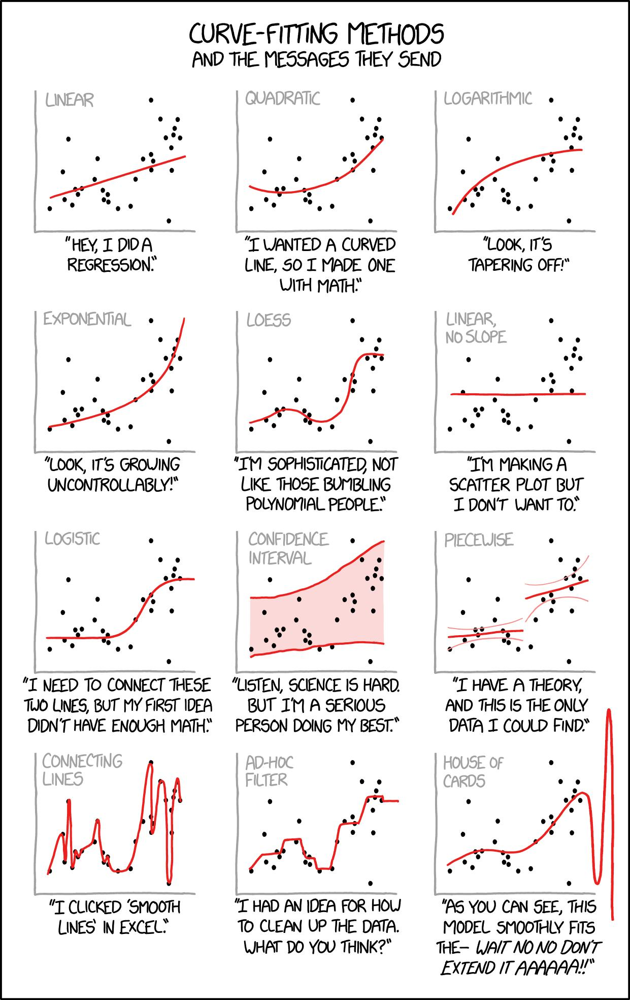

## Categorical data vs. Numerical data

- Categorical data is data that can be sorted into groups. For example, the color of a car.
- Numerical data is data that can be measured. For example, the weight of a car.

### Encoding

Regression models, such as linear and logistic regression, are designed to work with continuous variables. Therefore, when a categorical variable is included in a regression model, it must be converted into a set of binary variables, called dummy variables, one for each category. This is done because the categorical variable cannot be directly included in the model as it is.

Dummy variables are used to represent the categories of the categorical variable. Each category is assigned a binary value, usually 0 or 1, indicating whether the observation belongs to that category or not. This allows the regression model to take into account the relationship between the categorical variable and the target variable without assuming any particular ordering of the categories.

Additionally, using dummy variables allows the model to estimate the relationship between each category and the target variable, which can be useful for understanding the underlying relationships in the data.

It's important to note that when you create dummy variables, you should exclude one category as a reference category. This is to prevent collinearity in your dataset, as all the other dummies will be correlated with the excluded one.

#### Types of dummy variables

**One-hot encoding** (aka vectorization): This method creates a new binary variable for each unique category in a categorical variable. Each observation is then represented by a vector of binary values indicating the presence or absence of each category. One-hot encoding is useful when the categorical variable has a large number of categories or when the categories are not ordinal.

**Binary encoding**: This method creates a new binary variable for each category, but instead of indicating the presence or absence of each category, it encodes the category as a binary number. This encoding can be useful when the categorical variable has a moderate number of categories and the categories have an ordinal relationship.

**Target encoding** (aka weight of evidence encoding): This method replaces the categorical variable with the weight of evidence (WOE) of each category. WOE is a measure of how much the *category* is indicative of the target variable. Technically, this method replaces each categorical variable with the mean of all observations of the target value that have that category. Thus, target encoding is taking the relationship between the categorical variable and the target variable into account. This encoding can be useful when the categorical variable has a moderate number of categories and the categories have a strong relationship with the target variable.

**Ordinal encoding**: It assigns a unique integer value to each category in a categorical variable. This is done according to the order of the categories, such that the first category is assigned the value 0, the second category is assigned the value 1, and so on. This encoding method can be useful when the categorical variable represents an ordinal variable, i.e. a variable that has a natural order or ranking. For example, if the categorical variable represents a person's education level (e.g. "high school", "college", "graduate"), it would be appropriate to use ordinal encoding as the levels of education can be ordered.

**Frequency encoding**: It assigns a value to each category in a categorical variable based on the frequency of that category in the data. Specifically, the value assigned to a category is the number of times it appears in the data divided by the total number of occurrences of all categories in the variable. This encoding method can be useful when the categorical variable represents a variable that has a lot of categories and the categories with more observations have more importance. It can also be useful if the categorical variable has a high cardinality, meaning it has many unique categories.

**Count encoding**: This method replaces the categorical variable with the count of observations for each category. This encoding can be useful when the categorical variable has many levels and the categories have a strong relationship with the target variable.

It's important to note that depending on the dataset, the categorical variable, and the target variable, some encoding methods may work better than others. Therefore, it's important to experiment with different encoding methods and evaluate their performance using metrics such as accuracy or AUC-ROC.


## Curve-fitting



### Regression

- For continous variables.
- interpret a **score**

#### Logistic Regression

- A model is a logistic regression if you have two groups as the dependent variable.
- [This great video](https://www.youtube.com/watch?v=vN5cNN2-HWE) explains the concept.


#### Metrics to evaluate regression models

##### R2 (Coefficient of Determination)

- Percentage of the variance in the dependent variable that is predictable from (i.e. can be explained by) the independent variable(s).
- It is a statistical measure of how close the data are to the fitted regression line.
  
- R2 is a measure of how well observed outcomes are replicated by the model, based on the proportion of total variation of outcomes explained by the model.

Formula:
```
$$R^2 = 1 - \frac{SS_{res}}{SS_{tot}}$$
```

- `SS_res` is the unexplained variation in the response variable (the sum of squared residuals or sum of squared errors)
- `SS_tot` is the total variation in the response variable (the sum of squared total)

#### RMSE (Root Mean Squared Error)

RMSE measures the average magnitude of the error between the predicted values and the true values.

- RMSE is a measure of how spread out these residuals are. In other words, it tells you how concentrated the data is around the line of best fit.
- A RMSE of 0 indicates that the model perfectly predicts the response.
- A RMSE of 100 indicates that the model predicts the response with an average error of 100 (e.g. if the model predicts a price of $100 the actual value is $200, the error is $100).

##### ROC Curve (Receiver Operating Characteristic Curve) aka Sensitivity check

The ROC Curve is a plot of the **true positive rate (TPR)** against the **false positive rate (FPR)** at various threshold settings. The TPR is also known as sensitivity, and the FPR is one minus the specificity. The ROC curve is created by plotting the TPR against the FPR at various threshold settings. The ROC curve is used to select a threshold value for a model. AUC is useful to compare different models.

- [Great explanation of ROC Curve](https://www.youtube.com/watch?v=4jRBRDbJemM)
- ROC Curve is used to select a threshold value for a model. AUC is useful to compare different models.

### Classification

- For discrete variables.
- interpret **accuracy**

## Missing values

- **MCAR** (Missing Completely at Random): The missingness of the data is unrelated to the true values of the data.

    - **Example**: Power outage disrupts data collection.

- **MAR** (Missing at Random): The missingness of the data is related to the observed data (**independent** variable) but not the target variable.

    - **Example**:  For example, some respondents did not complete a certain survey module, but the probability of non-completion can be predicted by other variables such as `age` or `education`.
    - Fixable

- **MNAR** (Missing Not at Random): The missingness of the data is related to the target variable (**dependent** variable).

    - **Example**: People with higher income refused to respond to state it in the survey.
    - Not fixable


## Guides

- [Grundlagen schön erklärt von ehemaligem Kommilitonen](./Statistics_basics_Simon.pdf)
- [Probability distributions cheat sheet](./probability_cheat_sheet.png)