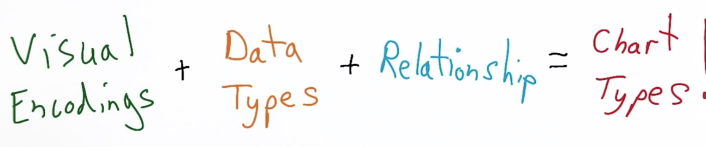

Theory: [Drawing Dynamic Visualizations - Bret Victor](https://vimeo.com/66085662)

## Tools

* [Tableau](http://www.tableau.com/academic) or [this link](http://www.tableausoftware.com/public/)

	Gives you a finished graphic which looks great!

* [RAW](http://raw.densitydesign.org/)

	Great online tool to create a graphic from tabular data and export it as svg, json or png!

* [Plotly](https://plot.ly/)

	Open Source Web Plots from R, Matlab, Python, Excel, JS code

* [Visage](http://visage.co/)

	VISUAL CONTENT CREATION MADE SIMPLE

## Theory

* Explanatory (data visualization) vs. exploratory data analysis (EDA)

* **Visual encodings** are the mapping of data to display elements
* Retinal variables (e.g. size, orientation, color saturation for ordered data or color hue, shape, texture for nominal data)
* Double encoding for emphasis of importance

### From visual encodings to charts

* grammar of graphics

## Blogs

* http://www.thefunctionalart.com/
* http://visualisingdata.com/
* http://www.storytellingwithdata.com/

## Community for help/input of visualizations

* http://helpmeviz.com/

## Examples of great visualizations

* [The Jobless Rate for People Like You](http://www.nytimes.com/interactive/2009/11/06/business/economy/unemployment-lines.html?_r=0)
* [MONEY wins ELECTIONS](http://letsfreecongress.org/)
* [A Visual Introduction to Machine Learning](http://www.r2d3.us/visual-intro-to-machine-learning-part-1/)
* [Visualizing Algorithms](https://bost.ocks.org/mike/algorithms/)
* [SLOPEGRAPH - Alberto Cairo: Three steps to become a
visualization/infographics designer](http://vizwiz.blogspot.de/2013/01/alberto-cairo-three-steps-to-become.html)
* [The Facebook Offering: How It Compares](http://www.nytimes.com/interactive/2012/05/17/business/dealbook/how-the-facebook-offering-compares.html?_r=1&)
* [UK Temperature History](http://charts.animateddata.co.uk/uktemperaturelines/)
* [Win, lose or draw](http://blog.thomsonreuters.com/wp-content/uploads/2014/07/semis-600x1024.jpg)

## Design Inspiration

* [Muzli](http://muz.li/)

	* Designers' Secret Source
	* All the design inspiration you need.
	* It’s like crack for designers. And good for you too!

* Nice websites

	[http://process.studio/]()

## Discussions about good visualizations

[When to Use Stacked Barcharts?](https://solomonmessing.wordpress.com/2014/10/11/when-to-use-stacked-barcharts/)