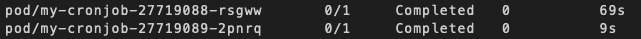

apiVersion: v1
kind: ConfigMap # define key-value pair to be used as data file
metadata:
  name: green
data:
  body: <body style="background-color:green;"></body>
---
apiVersion: v1
kind: Service # define service which exposes running container on port 80
metadata:
  name: green
spec:
  selector:
    app: green
  ports:
    - port: 80
```

## Jobs

### Job

```yaml
apiVersion: batch/v1
kind: Job
metadata:
  name: my-job
spec:
  completions: 10 # Run 10 times
  parallelism: 5 # Run 5 in parallel
  template:
    spec:
      containers:
        - name: alpine
          image: alpine:3.16.0
          command: ["sleep"]
          args: ["10"] # job takes 10 seconds.
      restartPolicy: Never
```

### Cron Job

Run action repeatedly. For each run of cron job a new pod starts and old ones get deleted (dependening on `successfulJobsHistoryLimit` value)



```yaml
apiVersion: batch/v1
kind: CronJob
metadata:
  name: my-cronjob
spec:
  schedule: "*/1 * * * *" # Runs every minute
  jobTemplate:
    spec:
      template:
        spec:
          containers:
            - name: alpine
              image: alpine:3.16.0
              command: ["/bin/sh"]
              args: ["-c", "date"]
          restartPolicy: OnFailure
  successfulJobsHistoryLimit: 2 # after completion, keep two jobs so that their logs may be observed
```
