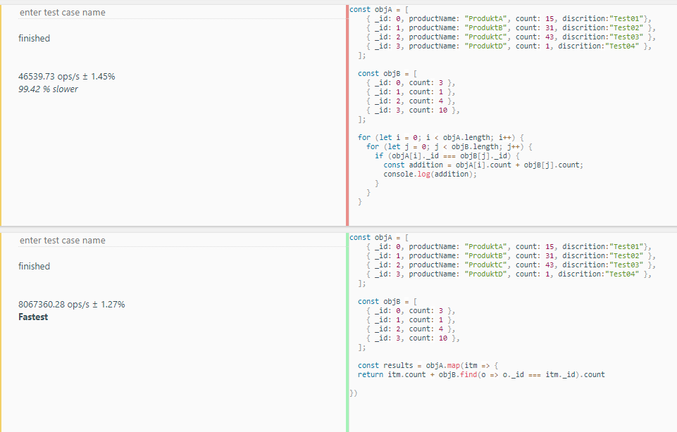
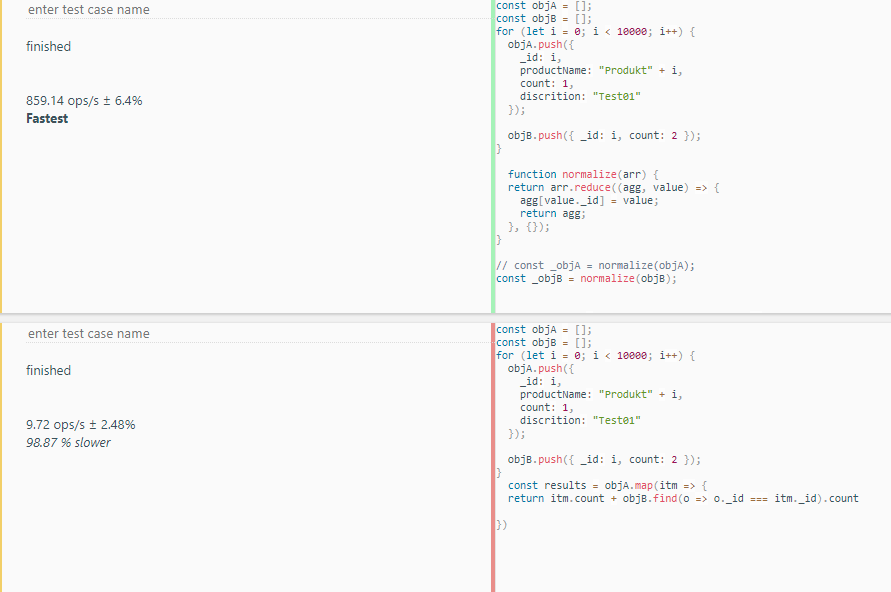

## What is time complexity?

Wikipedia defines [time complexity](https://en.wikipedia.org/wiki/Time_complexity) as

> [...] the computational complexity that describes the amount of computer time it takes to run an algorithm.

Usually this describes the **worst case** scenario. You can also add **best case** and **average case** scenarios to get a more fine-grained comparison.

## Why should I care about time complexity?

Time complexity calculations are irrelevant if your array contains a handful of elements.
But it can make a huge difference with a **large number of elements**. It's relevance increases exponentially.

As an example let's say one operation takes `1ms`. Here's how the computation time explodes for an `O(n * m)` algorithm as compared to an `O(n)` algorithm:

1. `objA.length` und `objB.length` be **10**:

  O(n) = 10ms
  O(n * m) = 100ms

  **Difference**: 10 fold

2. `objA.length` und `objB.length` be **1000**:

  O(n) = 1s
  O(n * m) = 1000s (over 16 minutes!)

  **Difference**: 1000 fold

3. `objA.length` und `objB.length` be **10000**:

  O(n) = 10s
  O(n * m) = 100000s (over 27 hours!)

  **Difference**: 10000 fold

**Verdict**: Time complexity is a very important topic for large arrays.

## Example

This is an example of a very simple way to implement the following problem:

> Add product's (identified by `_id`) `count` values together from two lists.

### Naive solution with 2 for loops

Complexity: **O(n * m)**

Actually it's a bit mean to call something a **naive** solution, but it's more of the mathematical sense here, meaning, a simple one. And simple might even have a positive connotation.

```js
const objA = [
  { _id: 0, productName: "ProduktA", count: 15, discrition:"Test01"},
  { _id: 1, productName: "ProduktB", count: 31, discrition:"Test02" },
  { _id: 2, productName: "ProduktC", count: 43, discrition:"Test03" },
  { _id: 3, productName: "ProduktD", count: 1, discrition:"Test04" },
];

const objB = [
  { _id: 0, count: 3 },
  { _id: 1, count: 1 },
  { _id: 2, count: 4 },
  { _id: 3, count: 10 },
];

for (let i = 0; i < objA.length; i++) {
  for (let j = 0; j < objB.length; j++) {
    if (objA[i]._id === objB[j]._id) {
      const addition = objA[i].count + objB[j].count;
      console.log(addition);
    }
  }
}
```

Here the **best case** equals the **worst case**, because the loops will finish every time.

### Functional solution: Hidden `O(n^2)` time complexity

Sometimes we are proud of **elegant** solutions but overlook time complexity issues.

Here an example which hoped to improve the solution, but it's time complexity is as slow as the example above, i.e. **O(n * m)**

```js
objA.forEach(
  item => item.count += objB.filter(
    itemB => itemB._id === item._id).length === 0 ?
    0 :
    objB.filter(itemB => itemB._id === item._id)[0].count
);
```

- Also, it's a bit hard to read.

### Functional solution 2:

Again, time complexity equals **O(n * m)**

```js
const results: number[] = objA.map(itm => {
  return itm.count + objB.find(o => o._id === itm._id).count
})
```

- Oddly here its performance is much better than the for loop example:

  

- By using the `find` function here, the best case and average case here are faster than the worst case. That is because the `find` function will terminate it's loop as soon as it finds a matching `_id`.

### Fast solution

```js
/**
 * Function which transforms an Array into an Object so that later access to the
 * fields of each entry in the array have a reduced complexity of O(1) instead of
 * O(n) because I don't need to loop through an array anymore but have direct access
 * to fields in an object.
 */
function normalize(arr) {
  return arr.reduce((agg, value) => {
    agg[value._id] = value;
    return agg;
  }, {});
}

// Here the objB array is made to an object. The transformation costs O(n).
const _objB = normalize(objB);

// Here I run through array A in time complexity 0(m) because accessing _objB
// only costs O(1) each time.
const computed = objA.map(value => {
  return { ...value, count: value.count + (_objB[value._id] ? _objB[value._id].count : 0) };
})
```

- The complexity calculation of this solution:

  `O(n) + O(m * 1)`, i.e. `O(m + n)` which can be reduced to `O(n)` because `m` is a constant (fixed size).

It's performance is much better as compared to the other algorihms when testing performance with [JSBench](https://jsbench.me/) for long arrays:

