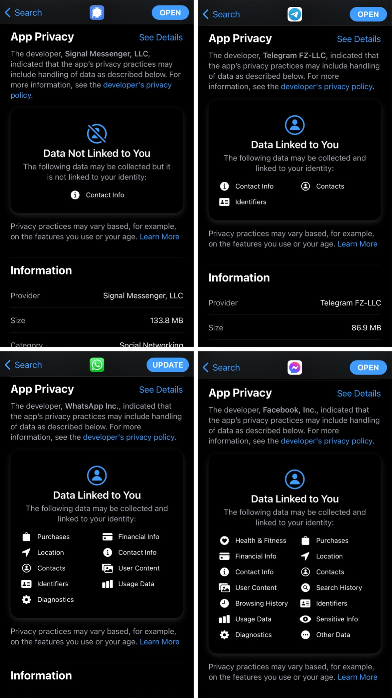

## Overview

Useful tools to communicate in privacy

- [Signal](https://www.signal.org/)

### What makes Signal more secure than WhatsApp?

Signal does not make cloud backups of your messages.

iOS 14.3 begins to offer a view with **Data Linked to You** to make data tracking more transparent. It directly revealed that

[@themitchpollock](https://twitter.com/themitchpollock) shared [this pic](https://twitter.com/themitchpollock/status/1339488325837701120?s=20) on Twitter:

Embedded Tweet:

<blockquote class="twitter-tweet">
These differences are really striking… <a href="https://t.co/0Pl7U4iiSv">pic.twitter.com/0Pl7U4iiSv</a>
&mdash; Mic 🌈 (@themitchpollock) <a href="https://twitter.com/themitchpollock/status/1339488325837701120?ref_src=twsrc%5Etfw">December 17, 2020</a></blockquote> 

#### WhatsApp is insecure

Even though WhatsApp has e2e encryption set up it has two major security flaws which expose the privacy of users

1. Cloud backups are not e2e encrypted.
2. [WhatsApp back door exposes data in 99% of cases](https://telegra.ph/whatsapp-backdoor-01-16)

### Where is Telegram positioned here?

- [Why does Telegram not e2e encrypt by default?](https://telegra.ph/Why-Isnt-Telegram-End-to-End-Encrypted-by-Default-08-14)

### Why "secure" options like Signal can be dangerous

- [Essay - Spy-funded privacy tools (like Signal and Tor) are not going to protect us from President Trump](https://surveillancevalley.com/blog/government-backed-privacy-tools-are-not-going-to-protect-us-from-president-trump)

  - About the issue that identities of people using security-rich apps can be tracked down.

## Links

- [Overview of tools which preserve privacy](https://www.privacytools.io/)