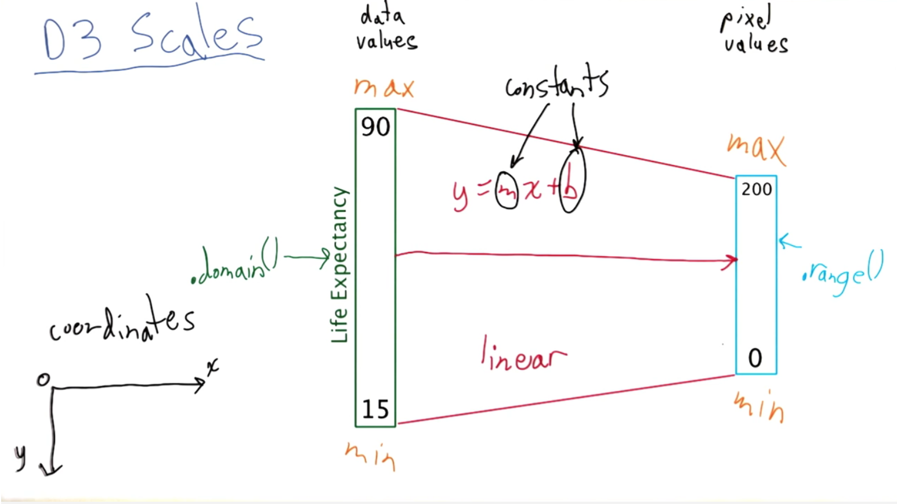

* Declarative API - Tell d3 what you want, not how you want it to get the result
* Decouple specification from execution

## D3 selection

* Returns an array with D3 objects.

	```js
	d3.select('.viewer-main');
	```
* Nested selection

	```js
	d3.select('#header-logo').select('img').attr('src', zipf);
	d3.select('#header-logo').html('');
	```

* Style

	```js
	d3.select('.viewer-main').style('background-color', 'green');
	```

* Anny Attribute

	```js
	d3.select('.img').attr('src', 'http://image-path');
	```

* `selectAll`

	```js
	d3.selectAll("div.col-xs-3");
	svg.append('circle').attr('r', 10).attr('fill', 'red').attr('cx', x(8347)).attr('cy', y(75));
	```


## Insert elements

```js
var svg = d3.select('div.col-xs-3').append('svg')
```

## Scales



Reminder: y-axis is inverted!

```js
var y = d3.scale.linear().domain([15, 90]).range([150, 0]);
var x = d3.scale.log().domain([250, 100000]).range([0, 250]);
```

## Group element

`g` corresponds to `div` in html

* Append rectangle **into** bar. `bar.append("rect")`