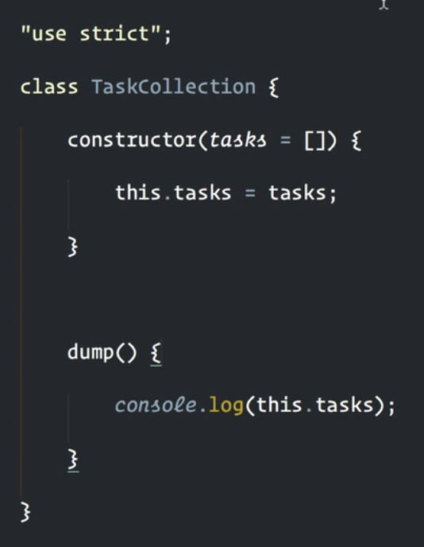
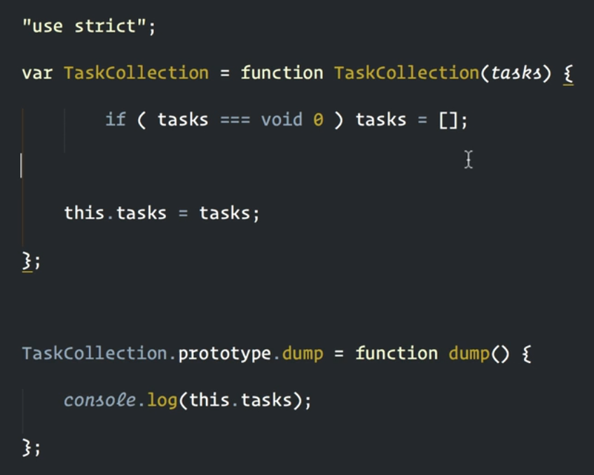

> Only getting a property considers the complete prototype chain of an object. Setting and deleting ignores inheritance and affects only own properties.

(from [this excerpt out of the book **SpeakingJS**](http://speakingjs.com/es5/ch17.html#prototype_relationship))

## Create an object with properties of a prototype

Given the object

```js
var PersonProto = {
  describe: function() {
    return 'Person named ' + this.name
  },
}
```

Create a new object with property `describe` inherited from prototype `PersonProto` and property `name` as an **own** property:

```js
var jane = Object.create(PersonProto)
jane.name = 'Jane'
```

or less common:

```js
var jane = Object.create(PersonProto, {
  name: { value: 'Jane', writable: true },
})
```

Here creating an object `B` where it's properties are all inherited from `A`:

```js
var A = {}
var B = Object.create(A)
```

## Generic Methods: Borrowing Methods from Prototypes

Call it like so

```js
Object.prototype.hasOwnProperty.call(obj, 'foo')
```

or shorter like so

```js
{}.hasOwnProperty.call(obj, 'foo')  // shorter
```

## Property Attributes and Property Descriptors

Properties can be added via descriptors

```js
Object.create(proto, propDescObj?)
```

## Constructors & Instances --> Creating prototypes

By convention, the names of constructors start with uppercase letters

```js
function Person(name) {
  this.name = name
}

Person.prototype.describe = function() {
  return 'Person named ' + this.name
}

var jane = new Person('Jane')
jane.describe() // 'Person named Jane'
```

## With ES6+ syntax `Class` is shortcut for setting prototype.

- ES6

  

- is compiled to:

  


## Example

```js
"use strict";

// ES6
class TaskCollection1 {
    constructor(tasks = []) {
        this.tasks = tasks;
    }

    dump() {
        console.log(this.tasks);
    }
}

// Legacy syntax
var TaskCollection2 = function TaskCollection(tasks) {
    if (tasks === void 0) tasks = [];
    this.tasks = tasks;
};

TaskCollection2.prototype.dump = function dump() {
    console.log(this.tasks);
}
```