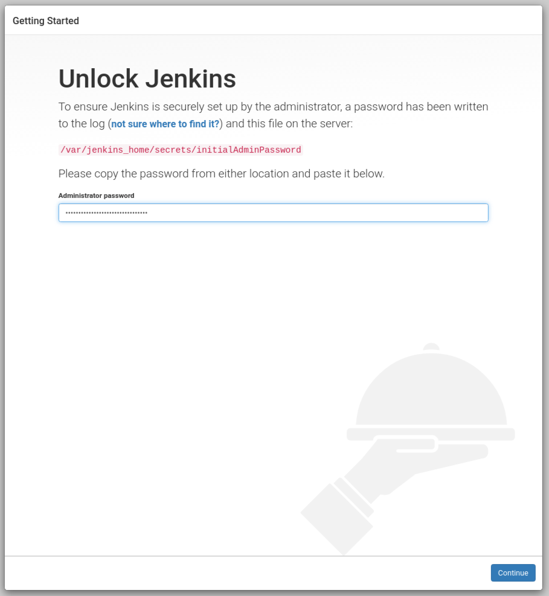
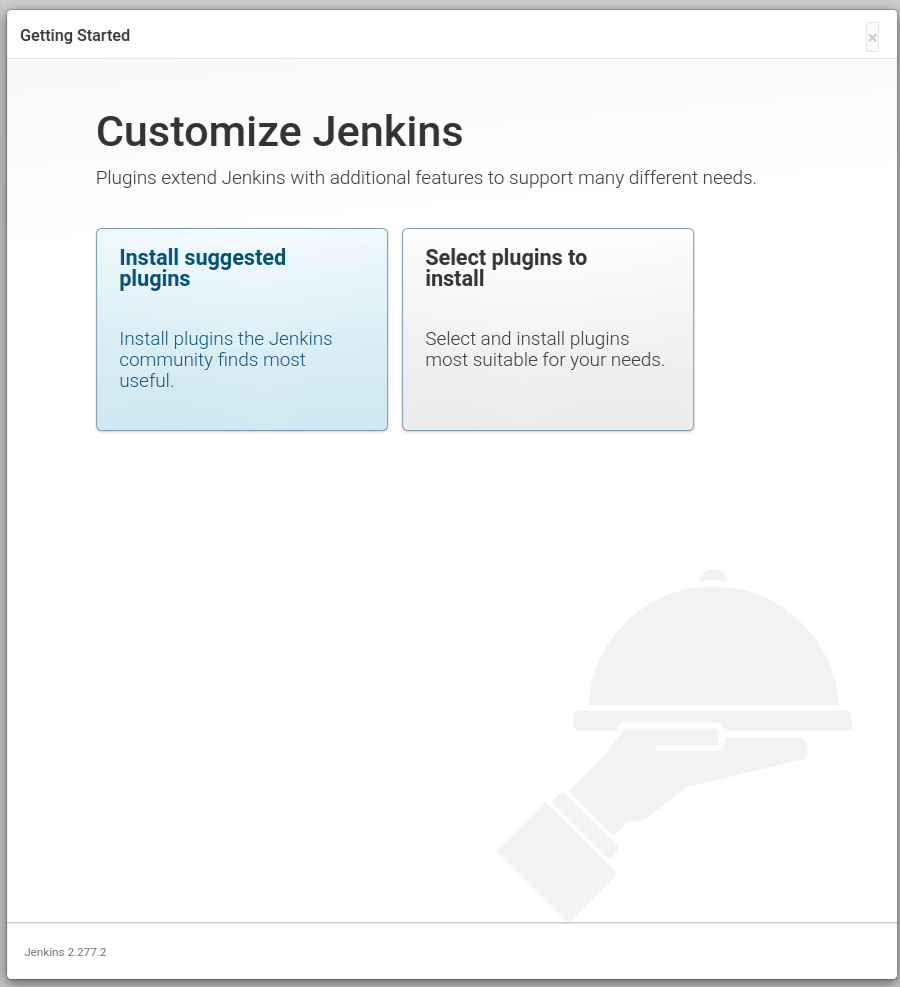
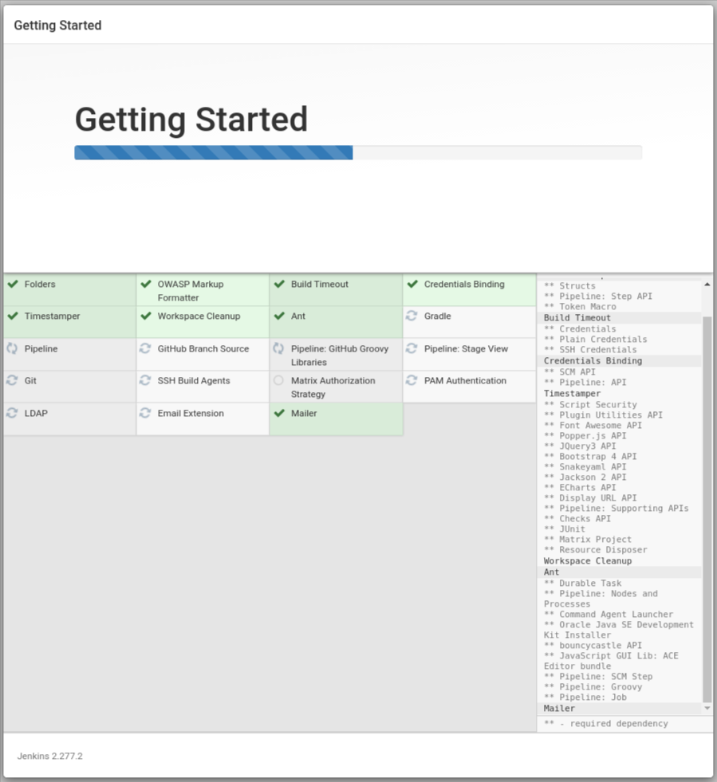
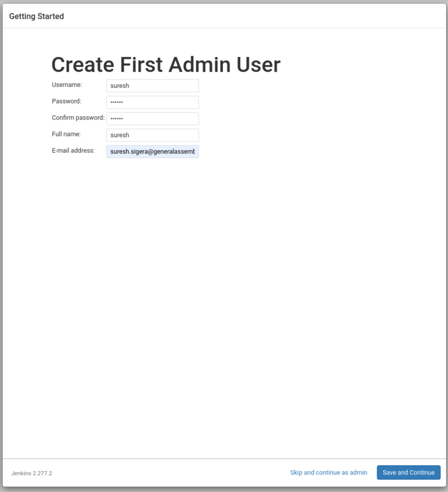
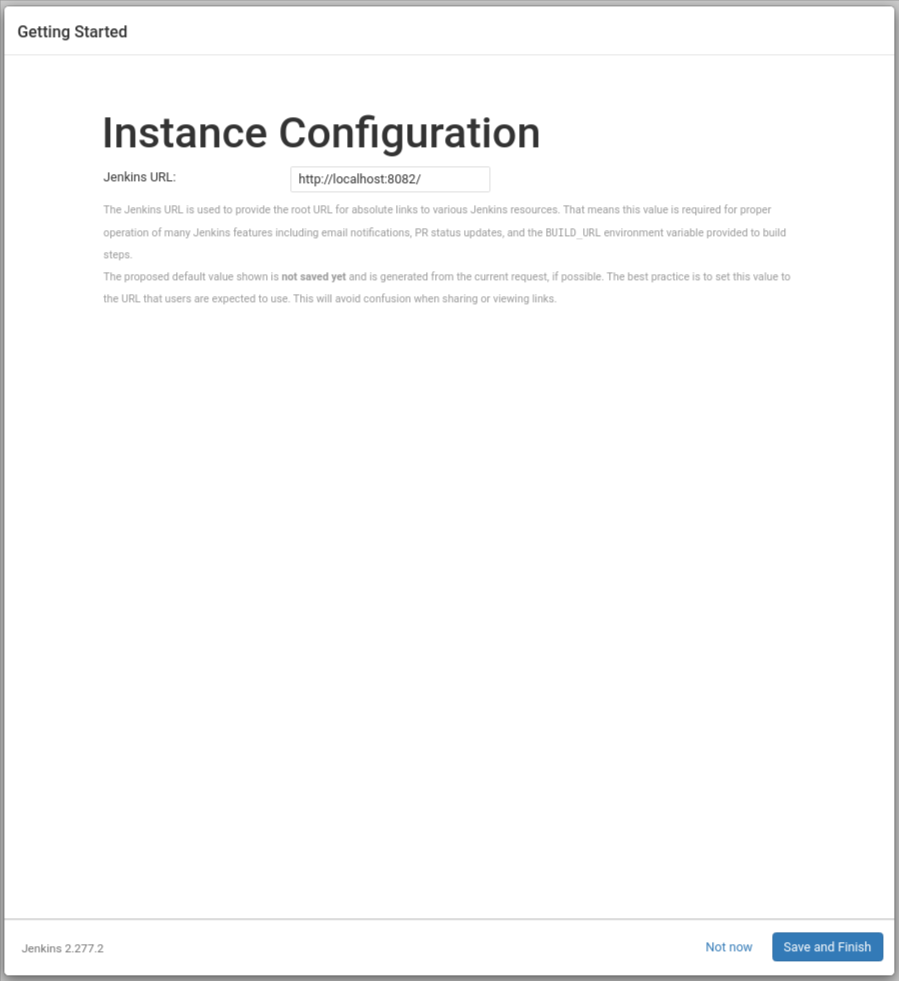
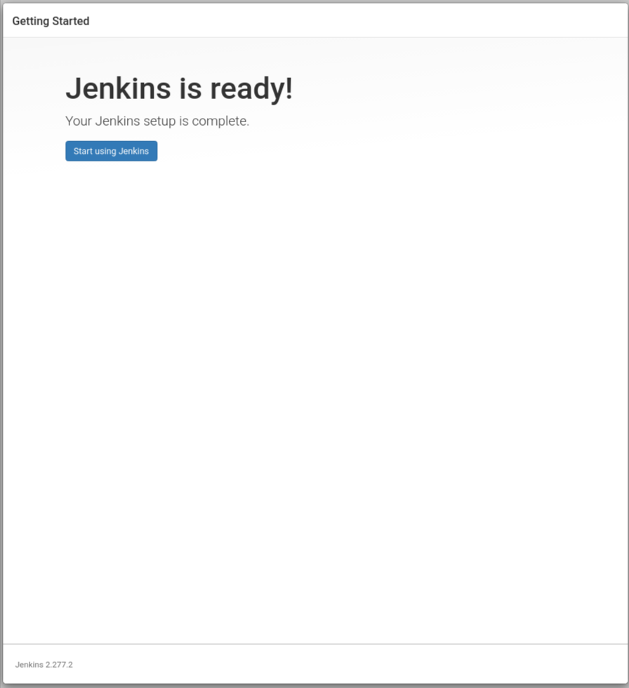
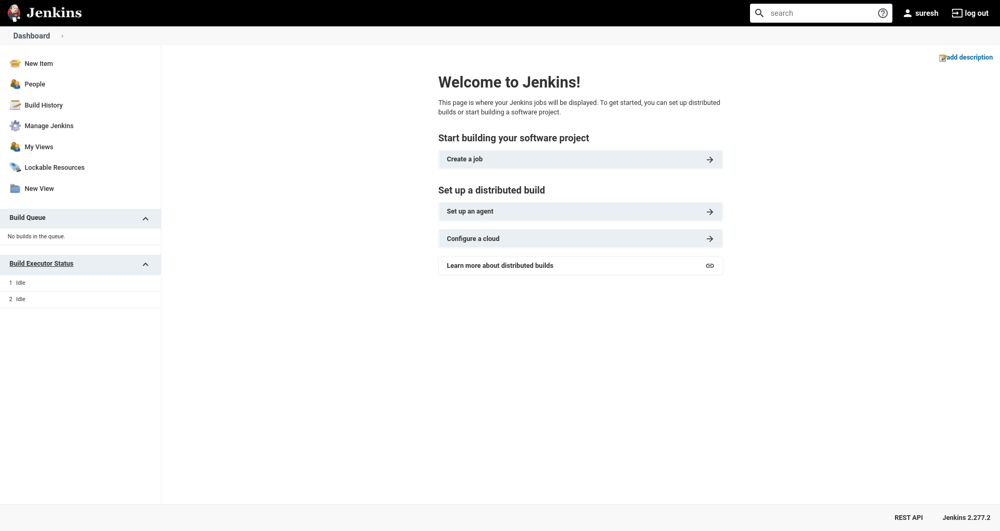

## Install Jenkins

1. Create a new folder named `jenkins-lab` in CLASSWORK/w08 and copy this `docker-compose.yml`:

	```yml
	version: "3.7"

	services:
	  jenkins:
	    image: jenkins/jenkins:lts
	    privileged: true # gives container capabilities of its host machine
	    user: root
	    ports:
	      - "8083:8080"
	      - "50003:50000" # less important: port that allows inbound agents to connect to Jenkins
	    container_name: jenkins-lab
	    volumes:
	      - ~/jenkins_data:/var/jenkins_home # persist Jenkins configuration files to `~/jenkins_data`
	      - /var/run/docker.sock:/var/run/docker.sock
	```

	As you see I call the container `jenkins-lab`. I will use that name in all further code snippets but feel free to choose whichever name you want.

2. Run Jenkins via `docker-compose up -d`

	(If you want you can look into the container via `docker exec -it jenkins-lab bash`)

3. Open `http://localhost:8083` in your browser (you might have to wait a bit until docker is done)
  You'll notice that I am using port `8083` instead of the default `8080`. The reason, other than demonstrating that you can use other ports, is that port  `8080`  is used by some frameworks like Spring Boot.

  If you run  `docker ps`, you should see your docker container running

4. Go to **Docker Desktop** to inspect the logs of the running Jenkins container and find the line "Please use the following password to proceed to installation" and copy the password.

	(Alternatively you can run `docker exec jenkins-lab cat /var/jenkins_home/secrets/initialAdminPassword` to get the password)

5. Set up Jenkins:
   1. Choose "Install suggested plugins"
   2. Create an admin user
   3. Confirm the Jenkins URL (`http://localhost:8083`) and hit "Save and Finish"

Some images of the Jenkins setup process:







Wait until the installation is complete and then you can proceed in creating your first admin user.







After creating the admin user, setup the Instance configuration. Since you are only using Jenkins locally, leave the URL to your localhost URL. Click on Save and Finish to start using Jenkins.



## Blue Ocean Plugin

### Install [blueocean](https://plugins.jenkins.io/blueocean) plugin to beautify Jenkins

1. In home of Jenkins click on **Manage Jenkins**
2. Click on **Manage Plugins**
3. In the Plugin Manager in the Available tab, search `blue ocean`.
4. Tick the box next to the plugin that's simply called 'Blue Ocean' and at the bottom click "Install without restart"
5. When done, click on "Go back to the top page"

### Slack Plugin

Let Jenkins post to Slack!

1. *Slack*: Install Jenkins plugin

	You have to be a Slack admin in order to install the Jenkins addon. Do so and copy the credential.

2. *Jenkins*: Install the **Slack Notification** plugin in a similar manner as the *blueocean* plugin.

3. After it's installed, click on **Manage Jenkins** again in the left navigation, and then go to **Configure System**. Find the Slack section and add the following values:

  - Workspace: `name of your workspace` (usually all lowercase)
  - Credential: Click on Add > Jenkins, then add a **secret text** credential using the value from step 2 (e.g. `abcdefg12345678`) as the value (pick any ID & Description)
  - Channel: `jenkins-updates`

4. DON'T TICK "Custom slack app bot user"!
5. Test the connection (if successful a message should appear in the `jenkins-updates` Slack channel) and press Save when you're done.

**Useful**: You can click on the question mark icons next to them for more information.

---

## Create a Pipeline

A  [**pipeline**](https://jenkins.io/doc/book/pipeline/)  is a suite of plugins that supports implementing and integrating continuous delivery pipelines into Jenkins.

A  **continuous delivery (CD) pipeline**  is an automated expression of your process for getting software from version control to your users and customers. Every change to your software (committed in source control) goes through a complex process on its way to being released. This process involves building the software in a reliable and repeatable manner, as well as progressing the built software (called a  **build**) through multiple stages of testing and deployment.

**Your Task**:

1.  Go back to the Jenkins home page ([http://localhost:8083](http://localhost:8080/)). Scroll down to the end and click  **`Create new jobs`**  under  **`Welcome to Jenkins!`**.
2.  Specify a name for your pipeline (e.g., `hello-world`).
3.  Scroll down and click  **`Pipeline`**, then click  `OK`  at the end of the page.
4.  Scroll down to the  `Pipeline`  section. You can also click on the  `Pipeline`  tab. 
5. As **`Pipeline script`** pick the "GitHub plus Maven** template and save.
6. Run (aka "Build now") your first pipeline!
7. This build will probably fail. --> To fix it go to **Manage Jenkins > Global Tool Configuration** and under **Maven installations** add Maven with Name `M3` which installs version `3.8.2` automatically from Apache.
8. Hit `Save` to apply the new Maven installation 
9. Go back to the pipeline and hit "Build now" again to re-run it.
10. Now re-run it in Blue Ocean: Go back to the Jenkins homepage, open the **Blue Ocean** interface and Click  **Run**  at the top left. Then, quickly click the  **OPEN**  link which appears briefly at the lower-right to see the pipeline run details.

## Jenkins + Slack

### Create a Jenkins freestyle project

1. Make sure your backend project is in an independent git repository, i.e. not inside the `HOMEWORK` repo (which itself is a git repo already)
2. In "Manage Jenkins" > "Configure System" set your GA GitHub enterprise username and email in the git section (not essential).
3. Create a new Jenkins "Freestyle project"
4. Under "Source Code Management" add your GA GitHub enterprise credentials (use your **email address** NOT your GitHub username) and the url of the repository you want to use.
5. Adjust the branch to build, probably `main`
6. As **Build Triggers** tick `Poll SCM` and set the schedule to poll every 2 min. Use the `?` help from Jenkins.
7. As a build step add "execute shell" and in there add the line `echo "Hi there"` and another line where you add an environment variable, e.g. `GIT_COMMIT` e.g. as `echo "Name of commit: ${GIT_COMMIT}`.

### Sending Slack notifications

8. As Post build action choose "Slack Notification" and tick all boxes.
9. Hit Save and run the job manually once! Do you see a Slack message?
10. Now go to your repository and create a file **README.md** in the root folder.
11. Write something into the file and commit. --> Do you see more Slack messages coming in after
12. Go to **Configure** (inside your job) to make changes to your project:
    1.  Play around with the "advanced" Slack settings.
    2.  Add some more lines of `echo` messages to your shell script.

---

## Jenkins build automation with a JAVA SpringBoot Application

### What?

We now build a pipeline which will ...

1. listen to changes in a **GitHub Enterprise repository** in *1min intervals*
2. Run integration tests.
3. Send out regular Slack messages

### Setup

1. Make sure your backend (i.e. your Spring Boot App) is in a single git repository - ideally as a folder inside your `development` directory.

2. Add Java 17 JVM in Jenkins config (we'll do this together).

  - Go to `Manage Jenkins` > `Global Tool Configuration` > `JDK`
  - Click on `Add JDK`
  - As **Name** enter `jdk-17.0.1`
  - Click on `Delete Installer` for the section that automatically appears
  - Click `Add Installer` then choose `Extract *.zip/*.tar.gz`
  - As **label** choose `master`
  - Use **Download URL** paste in `https://download.oracle.com/java/17/latest/jdk-17_linux-x64_bin.tar.gz`
  - As **subdirectory** choose `jdk-17.0.1`
  - Click on `Save`

3. We change the database for our Springboot integration tests

  Go to file `application-it.properties` and replace the contents with the following

```bash
# URL for my H2 Database
spring.datasource.url=jdbc:h2:mem:stationtestdb
# Database driver - we're using H2
spring.datasource.driverClassName=org.h2.Driver
# Dialect of SQL
spring.jpa.database-platform=org.hibernate.dialect.H2Dialect
```

This will change the database for tests from Postgres to h2.

4. Push changes to your backend repository.

### Your task in Jenkins

1. Create a "New Item" > "Pipeline"
2. Tick `Poll SCM` and have it poll events every minute.
3. Use the following as the pipeline script as starting point:

	Be sure to replace the repository `credentialsId` and `url` with your own.

	```groovy
	pipeline {
		agent {
			label "master"
		}

		tools {
			jdk "jdk-17.0.1"
		}

		stages {
			stage('Pre') {
				steps {
					slackSend channel: "#jenkins-updates", message: "Job ${env.JOB_NAME} started (Build number: ${env.BUILD_NUMBER})"
				}
			}

			stage('Test') {
				steps {
					git branch: 'main', credentialsId: 'abcdefg-abcd-42ab-8b46-e46abc1234c1', url: 'https://git.my-company.ly/my-organisation/my-repository'

					sh 'chmod +x mvnw'
					echo '--------- TESTING domain 1 ---------'
					sh './mvnw test -Dtest="Domain1IT"'
					echo '--------- TESTING domain 2 ---------'
					sh './mvnw test -Dtest="Domain2IT"'
				}
				
				post {
					// If Maven was able to run the tests, even if some of the test
					// failed, record the test results.
					success {
						junit '**/target/surefire-reports/TEST-*.xml'
					}
				}
			}
		}
	}
	```

4. Click on `Pipeline Syntax` underneath the pipeline script code block and a new window will open
  - In `Sample Step` choose `git:Git`
  - Paste in the repository URL from step 3, e.g. `https://git.my-company.ly/my-organisation/my-repository`
  - Click on the dropdown menu in `Credentials` that says `- none -` and choose your credentials (you should have generated these earlier)
  - Click on `Generate Pipeline Script`
5. Change the line `git branch: 'main', credentialsId: 'abcdefg-abcd-42ab-8b46-e46abc1234c1', url: 'https://git.my-company.ly/my-organisation/my-repository'` with what you create via the **pipeline snippet generator**.
6. Change the following tests `Domain1IT` and `Domain2IT` to reference your tests instead.
7. Test whether the job automatically starts by commiting to the main/master branch of your backend project.


**Improving the pipeline**

1. Send out three more Slack message commands at suitable places into the pipeline script.
2. Improve the Slack messages! Add some more environment variables (e.g. `${env.GIT_BRANCH}`). Go here to find all available environment variables: http://localhost:8083/env-vars.html/
3. Add some more `echo` commands to help you find things faster in the Logs.


## General

Jenkins Projects are saved in `~/.jenkins/workspace/` on your Continuous Integration server.

## Tips

* Start Shell scripts with the `-l` tag, i.e. `#!/bin/bash -l`

	e.g. here it's only executing a script which is in version control.

	```bash
	#!/bin/bash -l

	./internals/scripts/build-cms.sh
	```