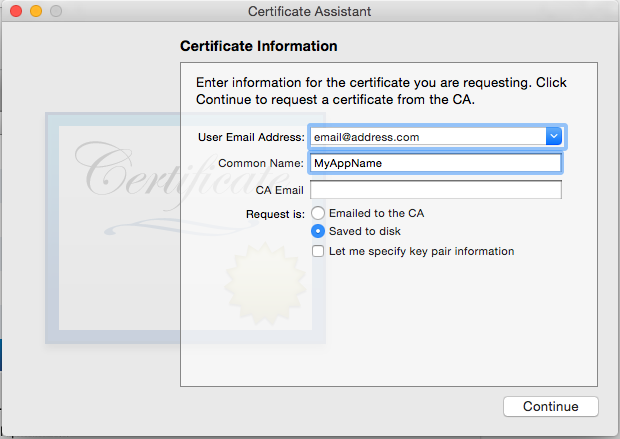
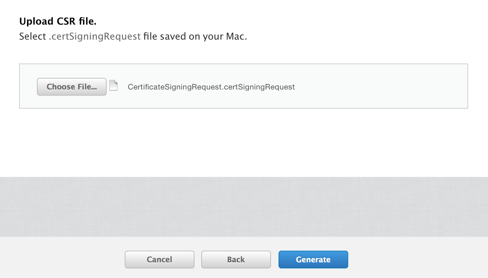
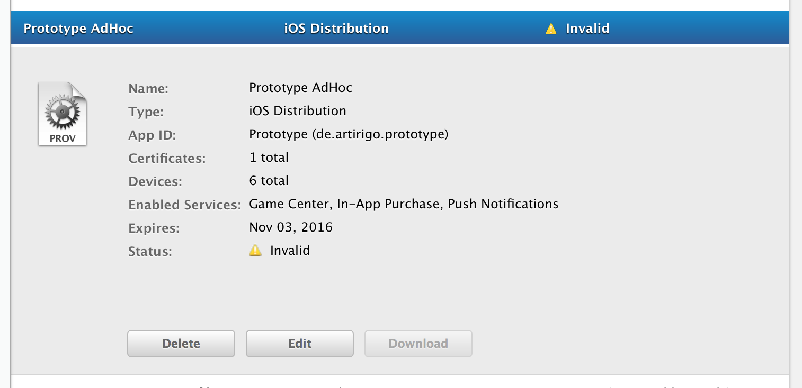

Mainly followed [this great tutorial from Ray Wenderlich](http://www.raywenderlich.com/32960/apple-push-notification-services-in-ios-6-tutorial-part-1)

Also check out [Creating .pem file for APNS?](http://stackoverflow.com/questions/1762555/creating-pem-file-for-apns) on StackOverFlow.

## Create APS Certificates

### Generate the Certificate Signing Request (CSR)

* Open the application *KeyChain Access*.
* Choose *Request Certificate from a Certificate Authority...*.
	
* This will open the *Certificate Assistant*.
* Save the file *CertificateSigningRequest.certSigningRequest* to the desktop.

### Save the p12 file

Find the private key, right click and export the key. Enter a passphrase for it.

### Create AppID

* Login into the Apple developer member center.

### Create SSL certificates

* Choose the app id and click *edit*
* Create *aps_development.cer* and *aps_production.cer*.
* Download the certificates when created.
* You don’t have to add the certificate to your keychain.

### Upload CSR File

### Make sure Provisioning profile is active

**Generate** it again so that it is *active*.

## Make a PEM File

Alternatively follow the [second answer in this stackoverflow thread](http://stackoverflow.com/questions/1762555/creating-pem-file-for-apns).
It lists different commands for **Development** and **Production**.

### Convert the .cer file into a .pem file

cd to the folder with the certificates

	$ openssl x509 -in aps_development.cer -inform der -out MyAppCertDevelopment.pem
	$ openssl x509 -in aps_production.cer -inform der -out MyAppCertProduction.pem

### Convert the private key’s .p12 file into a .pem file

	$ openssl pkcs12 -nocerts -out MyAppKey.pem -in MyAppKey.p12
	Enter Import Password:
	MAC verified OK
	Enter PEM pass phrase:
	Verifying - Enter PEM pass phrase:

You first need to enter the passphrase for the .p12 file so that openssl can read it. Then you need to enter a new passphrase that will be used to encrypt the PEM file.

### Combine the certificate and key into a single .pem file

	$ cat MyAppCert.pem MyAppKey.pem > myApp.pem

### Test whether the certificate works (regular, unencrypted, connection to the APNS server on port 2195)

	$ telnet gateway.sandbox.push.apple.com 2195

### Use SSL certificate and private key to set up a secure connection to APNS server

	$ openssl s_client -connect gateway.sandbox.push.apple.com:2195 -cert MyAppCertDevelopment.pem -key MyAppKey.pem

If following error occurs ([see this stackoverflow topic](http://stackoverflow.com/questions/22015306/ios-push-notification-sending-error)):

	depth=1 /C=US/O=Entrust, Inc./OU=www.entrust.net/rpa is incorporated by reference/OU=(c) 2009 Entrust, Inc./CN=Entrust Certification Authority - L1C
	verify error:num=20:unable to get local issuer certificate

	$ curl -O https://www.entrust.net/downloads/binary/entrust_2048_ca.cer
