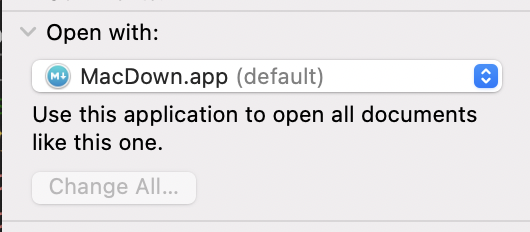

My guide on how to set up a fresh macbook.

This guide is inspired by [Tania Rascia's great blog article](https://www.taniarascia.com/setting-up-a-brand-new-mac-for-development/) and by ...

## Install applications

```bash
## Shell Programs
brew install \
  bat \
  exa \
  fzf \
  gifski \
  git \
  gpg \
  gnupg2 \
  pyenv \
  ipython \
  nvm \
  tldr \
  topgrade \
  youtube-dl &&

# heroku
brew tap heroku/brew && brew install heroku &&
# flutter version manager
brew tap leoafarias/fvm && brew install fvm &&

brew tap wix/brew && bew install --cask detox-instruments &&

# GUI programs
brew install --cask \
  appcleaner \
  arduino \
  arq \
  audacity \
  bluejeans \
  deepl \
  detox-instruments \
  discord \
  docker \
  drawio \
  dropbox \
  figma \
  firefox \
  flipper \
  flutter \
  flux \
  gather \
  github \
  google-chrome \
  google-drive \
  insomnia \
  intellij-idea \
  iterm2 \
  jitsi \
  keycastr \
  krisp \
  macdown \
  microsoft-teams \
  miro \
  ngrok \
  postman \
  postgresql \
  pycharm \
  react-native-debugger \
  rectangle \
  r \
  rstudio \
  setapp \
  signal \
  skype \
  slack \
  sourcetree \
  sublime-text \
  tableplus \
  teamviewer \
  telegram \
  the-unarchiver \
  thunderbird \
  timeular \
  tor-browser \
  tunnelblick \
  visual-studio-code \
  vlc \
  waltr-heic-converter \
  waterfox \
  wechat \
  wireshark \
  whatsapp \
  yippy \
  zoom
```

### Notes

- `virtualbox` does currently not run on ARM architecture

### Node.js

will install node v16

```
nvm install --lts
```

### Password manager

1password v7: `brew install --cask 1password`
1password v6: via https://1password.com/downloads/mac/#legacy-downloads

### Global npm packages

Installing [yarn](https://classic.yarnpkg.com/lang/en/docs/install/#mac-stable)

```
npm install --global \
    yarn \
    detox-cli \
    npm-check-updates \
    serve \
    expo-cli \
    eas-cli \
    firebase-tools &&
    svgo
npm install -g blitz --legacy-peer-deps
```

### Ruby


Install Ruby Version Manager **RVM** using [these instructions](https://rvm.io/):

   1. Install GPG keys: `gpg2 --recv-keys 409B6B1796C275462A1703113804BB82D39DC0E3 7D2BAF1CF37B13E2069D6956105BD0E739499BDB`
   2. Install RVM: `\curl -sSL https://get.rvm.io | bash -s stable` 

2. Install ruby version `3.0.0` via `rvm install 3.0.0`


### React Native

- `brew install --cask adoptopenjdk/openjdk/adoptopenjdk11` is a React Native Android requirement

    - You'll be asked to install Rosetta via `sudo softwareupdate --install-rosetta`

- `brew install watchman`
- Install [Android Studio](https://developer.android.com/studio/index.html)

### Python

#### Python install

Follow [this guide](https://mnzel.medium.com/how-to-activate-python-venv-on-a-mac-a8fa1c3cb511).

**Attention**: Always use `python3` (or `python3.9`) command. `python` command will point to OSX system python **2.7**!

See `pip-python.md` guide.

#### Python tools

- Anaconda - Install via dmg file
- poetry - install with install script from homepage

### 1password

Issue: M1 and 1password6 - can't install via AppStore -> no license!

[1password Chrome extension](https://chrome.google.com/webstore/detail/1password-extension-deskt/aomjjhallfgjeglblehebfpbcfeobpgk)


### Thunderbird

Use [this guide](https://www.lifewire.com/back-up-thunderbird-settings-1173141) to copy profile folder contents into new folder on new PC

### iTerm2 setup

### Tunnelblick VPN settings

1. Export in old PC
2. Import in new PC


### OSX System settings

#### Copy-paste keyboard shortcuts

- Change default of copying to clipboard vs. copying to file.

#### Keyboard Key Repeat speed

#### Markdown default editor

Change it to macdown



### DB

- **TablePlus**: export and import connections
- **Insomnia**: export and import collections
- **Postman**: Login into account in order to sync

#### Postgres

Install first user following [this setup guide](https://www.codementor.io/@engineerapart/getting-started-with-postgresql-on-mac-osx-are8jcopb).


### Some default

taken from https://www.taniarascia.com/setting-up-a-brand-new-mac-for-development

```
# Show Library folder
chflags nohidden ~/Library

# Show hidden files
defaults write com.apple.finder AppleShowAllFiles YES

# Show path bar
defaults write com.apple.finder ShowPathbar -bool true

# Show status bar
defaults write com.apple.finder ShowStatusBar -bool true

# Prevent left and right swipe through history in Chrome
defaults write com.google.Chrome AppleEnableSwipeNavigateWithScrolls -bool false
```

### Extra Apps

- **Loom**: It's homebrew version does not work for Macbooks with M1 chip.

## VSCode

Follow [these steps](https://code.visualstudio.com/docs/setup/mac#_launching-from-the-command-line) to launch vscode from the command line

### Sync extensions

1. Old PC: Login with github and enable sync
2. New PC: Login with github -> sync will start.

### Install extensions

Install extensions via VSCode Marketplace (symbol with four squares)

My favotite general (not language specific) extensions:

- [Error Lens](https://marketplace.visualstudio.com/items?itemName=usernamehw.errorlens): Show errors inline
- [Color Highlight](https://marketplace.visualstudio.com/items?itemName=naumovs.color-highlight): Highlight matching brackets
- [Quokka](https://marketplace.visualstudio.com/items?itemName=WallabyJs.quokka-vscode): Great for live code demos

#### HTML & JSX

- [Auto Rename Tag](https://marketplace.visualstudio.com/items?itemName=formulahendry.auto-rename-tag)

## Aliases

Add the following aliases file:

**TODO**

## Links

- [Eikes dot files](https://github.com/efoken/dotfiles)
- [Use Tania Rascia's guide as template](https://www.taniarascia.com/setting-up-a-brand-new-mac-for-development)

