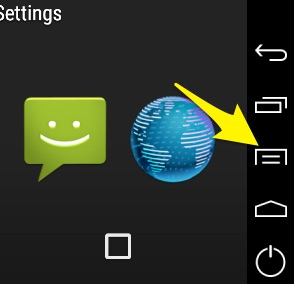

**Note (from August 2019)**: This doc is pretty outdated (first written in January 2016) and helped me a lot when React Native was still much more immature than it is now. Consider using **expo** these days which provides a much easier React Native workflow.

## Configurations

### Android configuration

Open **Android SKD Manager**: Open `Android Studio` and at bottom of Start screen go to `Configure/SDK Manager`

### iOS and Android Emulators

#### iOS

1.  open project file in xcode

  On **OSX** you can use the `open` command:

  ```bash
  open NameOfProject/ios/NameOfProject.xcodeproj
  ```

2.  Build project in Product/Build (will open a terminal - if you didn't start the development server in another terminal window yet)
3.  Wait until the react packager finished loading and hit run
4.  make a change in `index.ios.js` (or any other file) and hit `Cmd + R` to reload
5.  `Cmd + D` or `Cmd + ctrl + z` to open the React Native Dev Menu

#### Android

Emulator from `Android Studio`:

1. Open `Android Studio`, open any project and then in the top bar go to `Tools > AVD Manager`.
2. Run an emulator.
3. The emulator should now appear when typing `adb devices`

Other option: **Genymotion**

1. Open genymotion and run an emulator and check whether the device is running by running `adb devices`.

2. Load the app to the Android emulator

```bash
react-native run-android
```

###### Notes

IMPORTANT: Make sure all other virtual machines are turned off! Including `Docker for Mac`!
Check it with:

```bash
android avd
```

When the Android emulator is runngin, stretch the emulator windows such that the menu-item (see image) are visible. Only then the shortcut `Cmd + M` will open the React Native Dev Menu where you have to press `Reload JS` to make changes visible.



In case something doesn't work do the following.

1. stop currently running development server
2. Run `react-native start` to start a new one.

#### Errors

Perhaps another process is already using the same port. Run the following command to find out which process:

```bash
lsof -n -i4TCP:8081
```

You can either shut down the other process:

```bash
kill -9 <PID>
```

or run the packager on different port.

---

On Android it can happen that the app will appear in the application list of the device, but will still not run.
For it to run, further commands are necessary. The following is taken from [this stackoverflow discussion](http://stackoverflow.com/questions/32572399/react-native-android-failed-to-load-js-bundle):

To run with local server, run the following commands under your react-native project root directory

```bash
react-native start > /dev/null 2>&1 &
adb reverse tcp:8081 tcp:8081
```

To run without a server, bundle the jsfile into the **apk** by running:

1. Create an assets folder under `android/app/src/main`
2. Execute the following:

  ```bash
  curl "http://localhost:8081/index.android.bundle?platform=android" -o "android/app/src/main/assets/index.android.bundle"
  ```

#### Monitor

View files in emulator with the [Android Device Monitor](http://stackoverflow.com/questions/18530114/accessing-files-from-genymotion-sd-card):

```bash
monitor
```

## Run project on a real device

### iOS

- Change IP address in `ios/MyApp/AppDelegate.m` from `localhost` to IP Address of your notebook (e.g. `192.168.10.10` (find it in System Preferences/Network).
- In **Xcode** select your phone as build target and press "Build and run"

[Running On Device - iOS](https://facebook.github.io/react-native/docs/running-on-device-ios.html)

### Android

1. [These prerequisits](https://github.com/facebook/react-native/tree/master/ReactAndroid#prerequisites) which have to be fulfilled.
2. Run `$ react-native run-android`
3. Open the React Rage Shake Menu from within your app on your android device, go to `Dev Settings` and then to `Debug server host & port for device`. There enter your server IP (IP of your computer) and host `8081`, e.g. `192.168.50.35:8081`. On a mac you can find the IP of your computer at `System Preferences -> Network -> Advanced... -> TCP/IP -> IPv4 Address`.
4. Open the Rage Shake Menu again and click `Reload JS`.

[Running On Device - Android](http://facebook.github.io/react-native/docs/running-on-device-android.html#content)
