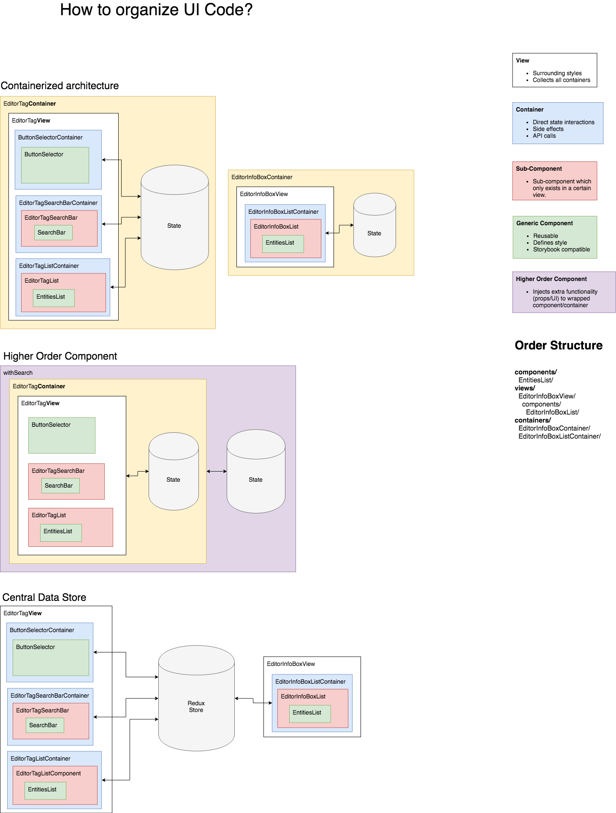

**React**: UI is a function of state and props.
**React Rendering**: Consists of two phases:

1. Render phase (creates virtual DOM and compares it with current browser DOM)
2. Commit phase (creates DOM on mount / surgically adapts changed components in browser DOM)

> ReactDOM.render renders a React element into the DOM


## Mounting vs. Rerendering

- **Mounting**

  - The first render is called a mount -> element is put into the DOM
  - If `key` prop changes, element is unmounted and mounted again. See [this article from Nik Graf](https://www.nikgraf.com/blog/using-reacts-key-attribute-to-remount-a-component).
  - Element gets unmounted if removed from the return value of a functional component.

- **Rerendering**

  - element in the DOM changes
  - triggered by changing `props` and `state` - unless the prop is used as default value of a `useState` hook.

    Here a changed `contact` prop will not update the shown `name` after a rerender. Only a remount will trigger a change from the outside. The `name` value is protected by the `useState` hook and cannot be changed.

    ```jsx
    const Detail = (props) => {
      const [name, setName] = useState(props.contact.name);
      return (
        <form>
          <input
            value={name}
            onChange={(evt) => setName(evt.target.value)}
          />
        </form>
      );
    };
    ```

  - child elements always rerender if their parent element rerender.
  - The following will cause a rerender, not an unmount and remount:

    ```jsx
    {name === "A" ? <Counter name="A" /> : <Counter name="B" />}
    ```

    React will see that it's the same `Counter` component and not remount, but just rerender.
    If `Counter` has some internal state (via `useState`) this state will not be resetted (what one may expect).

    The following will, however, trigger a rerender because the components are not the same:

    ```jsx
    {name === "A" ? <Counter name="A" /> : <p>EMPTY</p>}
    ```

## How the `react` framework works under the hood

> Using DOM API, HTML elements can be created or cloned in memory and manipulated without affecting the rendered DOM tree

Taken from [this article about the DOM](https://medium.com/jspoint/how-the-browser-renders-a-web-page-dom-cssom-and-rendering-df10531c9969)

The DOM Web API exposed by the browsers, allows UI frameworks (**Vue** and **React** alike) to efficiently create or clone html elements in memory and manipulate the DOM without affecting the actually rendered DOM tree - thereby realizing faster render times and a better user experience.

> **Reactivity**: Automatic synchronization between the app's state and the browser's rendered Document Object Model (DOM).

## `state` vs. `props`

Two types of **model** data in React: `state` vs. `props`

> If a Component needs to *alter* one of its attributes at some point in time, that attribute should be *part of its* `state`, otherwise it should *just be a* `prop` *for that Component*.

[See this article about props vs state](https://github.com/uberVU/react-guide/blob/master/props-vs-state.md)

### `props`

* `props` are a way of **passing data from parent to child**.
* `props` are immutable: they are passed from the parent and are **"owned"** by the parent.
* used for sending callbacks to the parent

### `state`

* mutable `state` of the component for interactivity, that is, data that changes over time.
* private to the component and can be changed by calling `this.setState()`

### `render()`

`render()` methods are written *declaratively* as functions of `this.props` and `this.state`.

## Components

### Stateful Component — Both props and state

We also call these **state managers**. They are in charge of client-server communication (XHR, web sockets, etc.), *processing data* and *responding to user events*. These sort of logistics should be encapsulated in a moderate number of Stateful Components, while all visualization and formatting logic should move downstream into as many Stateless Components as possible.

e.g. in the tutorial the client-server communication was done in the `CommentBox` component, while the other logic was passed down to the `CommentList` and `Comment` components.

### Functional components (just `render`)

Define all props using destructuring: `const UnstyledButton = ({ text, onClick, variant }) => (`

```js
/**
 * Button represents a default button which accepts three props: text,
 * onClick and variant.
 *
 * Note that this Button needs styles applied through react-css-modules;
 * to use default styles declared here import the 'Button' component.
 */
const UnstyledButton = ({ text, onClick, variant }) => (
    <Button
      styleName={ styles[variant] }
      onClick={ onClick }>{ text }</Button>
);
// Note: 'styleName' is react-css-module's version of the 'className' prop

// Create a Button with the default styles applied
const Button = css(Button, styles);

export default Button;
export UnstyledButton;
```

### Component Life cycle


And here a graphic designed by **Dan Abramov**:


## Refs

Refer to DOM elements with refs, e.g. focus on an input field

```js
React.findDOMNode(this.refs.input).focus();
...
	<input ref='input' value={} />
```

## JSX

```js
var Nav, Profile;
// Input (JSX):
var app = <Nav color="blue"><Profile>click</Profile></Nav>;
// Output (JS):
var app = React.createElement(
  Nav,
  {color:"blue"},
  React.createElement(Profile, null, "click")
);
```

## React Low-level API

### `cloneElement`?

- To change props of of elements which are already rendered, e.g. `<Icon />` in `<ButtonIcon />`
- Look at `_renderGroupedChildren()` in `Button.js`

## Mixins

* In component `CameraAction.js`: What is a React mixin? How does the `_mixinFrameStyle()` thing work?

	```js
	this.setState(this._mixinFrameStyle({
		currentAction: ACTIONS.CAMERA,
	}));
	```

  Definition of `_mixinFrameStyle`:

  ```js
	_mixinFrameStyle(state = {}) {
    if (this._lastOrientation) {
      const orientation = this._lastOrientation;
      this._lastOrientation = null;

      LayoutAnimation.easeInEaseOut();
      state.frameStyle = this._frameStyle(orientation);
      state.orientation = orientation;
    }

    return state;
  }

  _frameStyle(orientation) {
    return (
      orientation === LANDSCAPE
        ? FRAME_LANDSCAPE_STYLE
        : FRAME_STYLE
    );
  }
	```

	**Answer**:

	* A mixin mixes something to the response, i.e. here the `_mixinFrameStyle()` mixes the orientation which is stored in an instance variable `_lastOrientation` (received from an event listener callback) into the store during the `setState` command.
	* A mixin was created here because this setting of orientation in the state is used at several places.
	* Mixins can be chained, one for each functionality.
	* If the orientation were just written in the state here, the orientation frame would also change if we are in the child component `PhotoDecide` in which we don't want the frame to change. When going back to the camera from here, we again want the frame to change, so the mixin is called here, when the state is set.

## React Code Organization



## React tips and tricks

Note that native HTML element names start with a lowercase letter, while custom React class names begin with an uppercase letter.

### Only render if existing

```js
<View>
	{renderEmptyState && renderEmptyState()}
</View>
```

### setState()

Only use `setState()` if you use that part of state in `render()` function. Otherwise it's a performance waste!

## Manual setup

When not using `create-react-app` or another setup where React is preconfigured, do the following:

Include in main html file:

```html
<script src="link/to/react.min.js"></script>
<script src="link/to/JSXTransformer.js"></script>
```

Call scripts from global folder `/js/` which runs in a browser where the root is the current folder:

```html
<script type="text/jsx;harmony=true" src="/js/components/TaskList.js"></script>
```

At bottom of root component include

```js
React.render(<MyRootComponent />, document.body);
```

## React discussion

The following answers questions about `react` like:

* Can I build something complex with React?
* Who Uses React.js?
* Can React be used with other JavaScript MVC Frameworks? (e.g. also Ember)

[React.js and How Does It Fit In With Everything Else?](http://www.funnyant.com/reactjs-what-is-it/)

[Ember + React Discussion](http://discuss.emberjs.com/t/can-reactjs-be-used-as-a-view-within-emberjs/3470/6)

## Links

### Component libraries

- [Chakra.ui](https://chakra-ui.com/)

### React frameworks

- [Blitz.js to build Web-Apps fast](https://blitzjs.com/docs/getting-started)

### Tools to check out

- [Sanity - CMS built with React](https://www.sanity.io/react-cms)

- [React Pose](https://medium.com/@joomiguelcunha/amazing-react-animation-with-react-pose-3b67d9eb6e07)
- [React Concurrent Mode](https://reactjs.org/docs/concurrent-mode-adoption.html)
- [react-refresh](https://twitter.com/0xca0a/status/1216696377369145344)
- [react-hook-form](https://react-hook-form.com/)

### Tutorials

- [Getting started](https://facebook.github.io/react/docs/getting-started.html)
- [Official Tutorial](https://facebook.github.io/react/docs/tutorial.html)
- [JSX in depth](https://facebook.github.io/react/docs/jsx-in-depth.html)