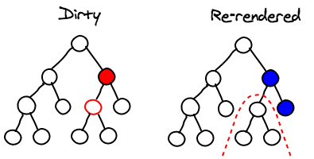

## Problem

Rerendering issue (i.e. slow performance) of children with lots of data if only a small part of shared state changes.

## Background
The infobox list, in its basic form, contains a list of infoboxes to be rendered and a button which opens a pop-up to render the infoxbox. Opening and closing the pop-up however takes longer than expected even after the requested data is fetched. This was observed during the stage of development when the `InfoboxListContainer` managed the state of both the fetched infobox list as well as the pop-up.

## Findings
* Shortening the list decreased the waiting time `=>` list dependent.
* Profilers and checkpoints showed render methods for the `EntityList` component - the most basic component `=>` list is being rendered when it is not expected to.
* Separating the two states by moving the pop-up rendering to a different component made a performance improvement of 25% - though still slow on IE11.
* Using keys from React has no effect since the pop-up and the infobox-list aren't part of an array.
* The painting for IE11 takes about 1 second. This includes computing the styling. (Independent of JS code)

## Explanation

The reason for the unwanted rerenderings of the list (with the pop-up (a.k.a. modal) as parent or in the same file, is that the list and the popup props are in the same state. So if one of them changes, it would rerender itself and the also trigger rerenders in its children (where the list is one of them).

Hence, closing the Popup changes changes `popup: true` to `popup: false` (in the state of `EditorInfoBoxListContainer` which is the parent of `InfoboxListContainer`). This leads to updating all of its children.

## Solution

Applying a shallow comparison of the list in `shouldComponentUpdate` of the list components (down to the last child, i.e. `EntitiesList`) stop unnecessary rerenders of the list while interacting with the Popup:

The right hand side tree in the image [out of this good article about React performance](https://medium.com/front-end-hacking/performance-optimizing-a-react-single-page-app-part-2-92a0f0c83202) uses shallow comparison with Pure components, the left hand side tree does not.

**Further possible improvements**:

1. Store list in an *immutable* data structure to ease shallow comparisons.
2. Redux + selectors

	* Really separate containers with selective access to a general state (e.g. a Redux store for that matter) via selectors which use memoization etc (e.g. https://github.com/reduxjs/reselect). Alternatively redux's `select()` could be used. It is compared to and the `reselect` library [in this article](https://netbasal.com/lets-talk-about-select-and-reselect-in-ngrx-store-177a2f6045a8).

	* With a central redux state, The Popup and InfoboxList components would not be in a parent-child relationship and thus changing the popup state would not cause the Infoboxlist to rerender.
