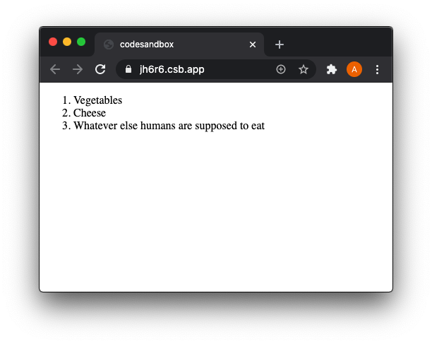
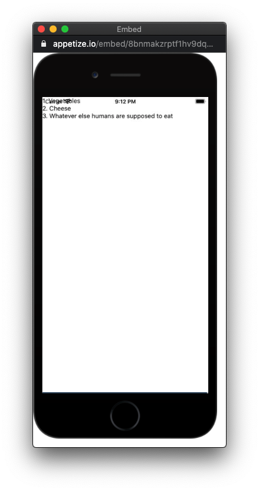

Let's compare [Vue](https://vuejs.org/), [React](https://reactjs.org/), React with [TypeScript](https://www.typescriptlang.org/), [React Native](https://reactnative.dev/) and [Vue Native](https://vue-native.io/) by implementing a tiny app: An ordered list of three items (as used in the [Vue.js beginners guide](https://vuejs.org/v2/guide/)):

<p align="center">
    
</p>

There are a lot of articles on the web which compare Vue and React. But they either [have click-bait titles](https://medium.com/swlh/is-vue-js-going-to-take-over-react-in-2020-929c19806ac) and usually [compare metrics (like number of GitHub stars) whose significance is questionable](https://www.monterail.com/blog/vue-vs-react-2020). If an [article does compare code](https://sunilsandhu.com/posts/i-created-the-exact-same-app-in-react-and-vue-2020-edition), it doesn't include the mobile frameworks **React Native** and **Vue Native**. Thus, this article implements a small app in five different forms.

To get most out of this article you should have some basic knowledge of html, CSS and Javascript and at best you have used either **Vue** or **React** before so you know about concepts like [components and props](https://reactjs.org/docs/components-and-props.html).

All (but the Vue Native) examples include links to their implementations where you can play around with the Web or Mobile App (in **CodeSandBox** or **Expo Snack**):

- Shortcuts to the five code examples (or their playground environments):

  - [Vue.js (Web)](#vuejs-web) [[CodeSandBox](https://codesandbox.io/s/grocery-list-vue-jh6r6)]
  - [React (Web)](#react-web) [[CodeSandBox](https://codesandbox.io/s/grocery-list-react-o1n6h?file=/src/App.js)]
  - [React with TypeScript (Web)](#react-with-typescript-web) [[CodeSandBox](https://codesandbox.io/s/grocery-list-react-typescript-16qrq?file=/src/App.tsx)]
  - [React Native (Mobile)](#react-native-mobile) [[Expo Snack](https://snack.expo.io/@andrusch/grocery-list-react-native)]
  - [Vue Native (Mobile)](#vue-native-mobile)

## Reactivity

Both, **Vue** and **React** add the benefit of [reactivity](https://stackoverflow.com/questions/54476619/how-does-vue-js-reactivity-work-under-the-hood) to the apps you build with them by returning a virtual representation of the actually rendered elements (which are represented in the browser's Document Object Model (DOM) tree). With this virtual DOM tree more efficient updates of the user interface are possible.

This article compares the basic usage of **Vue** and **React** to build Web or Mobile Apps but does not talk about its internal differences.

## A simple app 💻

Each implementation in this article will display this array of three elements in an ordered list:

```js
const groceryList = [
  { id: 0, text: 'Vegetables' },
  { id: 1, text: 'Cheese' },
  { id: 2, text: 'Whatever else humans are supposed to eat' },
];
```

### Vue.js (Web)

Let's start with **Vue**. The app we're looking at is basically **App7** of the [Vue.js beginners guide](https://vuejs.org/v2/guide/)) (adjusted a bit so it directly runs [in this CodeSandBox](https://codesandbox.io/s/grocery-list-vue-jh6r6)):

As in traditional **JavaScript** development **Vue** splits up the user interface (UI) into a **template** (written in `html`) which describes the form of the UI and a **script** (written in `JavaScript`) which adds interactivity to the **static** (which means "non-interactive") template.

Thus, `App.vue` has two parts:

1. The **template**:

    ```html:title=App.vue {5-7}
    <template>
      <div id="app">
        <ol>
          <Item
            v-for="item in groceryList"
            v-bind:item="item"
            v-bind:key="item.id"
          />
        </ol>
      </div>
    </template>
    ```

    - The `v-` prefixed words are called **directives** in Vue.js which apply special reactive behavior to the rendered DOM.

2. The **script**:

    ```html:title=App.vue {10-13,17-19}
    <script>
      import Vue from 'vue';

      const groceryList = [
        { id: 0, text: 'Vegetables' },
        { id: 1, text: 'Cheese' },
        { id: 2, text: 'Whatever else humans are supposed to eat' },
      ];

      Vue.component('Item', {
        props: ['item'],
        template: '<li>{{ item.text }}</li>',
      });

      export default {
        name: 'App7',
        data: () => ({
          groceryList,
        }),
      };
    </script>
    ```

    - Here the `groceryList` array appears and is exported as `data` in line 19.
    - Components in **Vue** are defined with the `component` method (line 10) in which options (`props`, `template` etc.) are defined. Here the `Item` component accepts the prop `item`.
    - The component must not be exported because it is defined on the global `Vue` variable.

There's a second file `main.js`:

```js:title=main.js
import Vue from 'vue';
import App from './App.vue';

Vue.config.productionTip = false;

new Vue({
  render: (h) => h(App),
}).$mount('#app');
```

- `main.js` connects the Vue App to the eventually rendered UI in the browser. This eventually rendered UI is represented in the browser as the so-called Document Object Model (DOM) - a tree structure of nodes which make up each rendered website.
- Play around with the Vue example [in this CodeSandBox](https://codesandbox.io/s/grocery-list-vue-jh6r6).

### React (Web)

The same implementation using `React`:

```jsx:title=App.js {9,15-17}
import React from 'react';

const groceryList = [
  { id: 0, text: 'Vegetables' },
  { id: 1, text: 'Cheese' },
  { id: 2, text: 'Whatever else humans are supposed to eat' },
];

const Item = ({ item: { id, text } }) => <li key={id}>{text}</li>;

const App7 = () => {
  return (
    <div>
      <ol>
        {groceryList.map((item) => (
          <Item item={item} />
        ))}
      </ol>
    </div>
  );
};

export default App7;
```

- In **React** there is no separation between **template** and **script** as in **Vue**.
- The `Item` **component** is defined in line 9 and used in line 16.
- The `Item` component is a function. In line 9 [object destructuring](https://developer.mozilla.org/en-US/docs/Web/JavaScript/Reference/Operators/Destructuring_assignment#Object_destructuring) is used to retrieve the `props` directly. That is, `text` can directly be used as compared to `item.text`.

```jsx:title=index.js
import React from 'react';
import ReactDOM from 'react-dom';

import App from './App';

const rootElement = document.getElementById('root');
ReactDOM.render(
  <React.StrictMode>
    <App />
  </React.StrictMode>,
  rootElement
);
```

The `map` function renders all items.

Play around with the React code in this [CodeSandBox](https://codesandbox.io/s/grocery-list-react-o1n6h?file=/src/App.js).

### React with TypeScript (Web)

The **React** app written in **TypeScript**. The changed lines are highlighted:

```tsx:title=App.tsx {1,3-7,9,15-17,19}
import React, { FunctionComponent } from 'react';

type GroceryListItem = {
  id: number;
  text: string;
};
type GroceryList = ReadonlyArray<GroceryListItem>;

const groceryList: GroceryList = [
  { id: 0, text: 'Vegetables' },
  { id: 1, text: 'Cheese' },
  { id: 2, text: 'Whatever else humans are supposed to eat' },
];

const Item: FunctionComponent<{ item: GroceryListItem }> = ({
  item: { id, text },
}) => <li key={id}>{text}</li>;

const App7: FunctionComponent = () => {
  return (
    <div>
      <ol>
        {groceryList.map((item) => (
          <Item item={item} />
        ))}
      </ol>
    </div>
  );
};

export default App7;
```

`index.tsx` didn't change much. [React.StrictMode](https://reactjs.org/docs/strict-mode.html) is not necessary with TypeScript anymore:

```tsx:title=index.tsx
import * as React from 'react';
import { render } from 'react-dom';

import App from './App';

const rootElement = document.getElementById('root');
render(<App />, rootElement);
```

Play around with the React + TypeScript code in this [CodeSandBox](https://codesandbox.io/s/grocery-list-react-typescript-16qrq?file=/src/App.tsx).

### React Native (Mobile)

React Native allows you to use React to create mobile apps for iOS and Android.

Our simple list would look like this in `React Native`:

<p align="center">
    
</p>

The list starts at the top left and is partly covered by the phone's status-bar because we don't add any styles to keep it simple.

```jsx:title=App.js {2,10,16-20}
import React from 'react';
import { FlatList, Text } from 'react-native';

const groceryList = [
  { id: 0, text: 'Vegetables' },
  { id: 1, text: 'Cheese' },
  { id: 2, text: 'Whatever else humans are supposed to eat' },
];

const Item = ({ index, text }) => <Text>{`${index}. ${text}`}</Text>;

const renderItem = ({ item, index }) => <Item index={index} text={item.text} />;

const App7 = () => (
  <>
    <FlatList
      data={groceryList}
      renderItem={renderItem}
      keyExtractor={({ id }) => id}
    />
  </>
);

export default App7;
```

- We use React Native's built-in [FlatList](https://reactnative.dev/docs/flatlist.html) component (imported in line 2) which can efficiently display long lists.
- In line 10 a numbered list is simulated with the help of a [template literal](https://developer.mozilla.org/en-US/docs/Web/JavaScript/Reference/Template_literals).
- Play around with the React Native code in this [Expo Snack](https://snack.expo.io/@andrusch/grocery-list-react-native).

### Vue Native (Mobile)

In the [Vue Native docs](https://vue-native.io/docs/index.html#What-is-Vue-Native) **Vue Native** is described as follows:

> **Vue Native** is a mobile framework to build truly native mobile app using **Vue.js**. Its is designed to connect **React Native** and **Vue.js**.
> Vue Native is a **wrapper around React Native APIs**, which allows you to use Vue.js and compose rich mobile User Interface.

The **React Native** implementation could look like this in **Vue Native**:

```html:title=App.vue {3,21-29}
<template>
  <view class="container">
    <flat-list :data="groceryList" :render-item="(item) => renderList(item)" />
  </view>
</template>

<script>
  import React from 'react';
  import { Text } from 'react-native';

  const groceryList = [
    { id: 0, text: 'Vegetables' },
    { id: 1, text: 'Cheese' },
    { id: 2, text: 'Whatever else humans are supposed to eat' },
  ];

  const Item = ({ index, text }) => <Text>{`${index}. ${text}`}</Text>;

  export default {
    name: 'App7',
    data: () => ({
      groceryList,
    }),
    components: { Item },
    methods: {
      renderList: ({ item, index }) => {
        return <Item index={index} text={item.text} />;
      },
    },
  };
</script>
```

- Line 3 shows how React Native's `flatlist` is used as a Vue component.
- The `Item` component must be defined as in **React Native** (and not as a Vue component) because it is used in the `renderList` method (which is used in the `flatlist` component in line 3).

### Alternative (more Vue-like) implementation

If you want to define the `Item` component as a Vue component you have to forfeit on using React Native's [FlatList](https://reactnative.dev/docs/flatlist.html) component.

Let's create a Vue component `item.vue` first:

```html:title=components/item.vue
<template>
  <text> {{item.id}}. {{item.text}} </text>
</template>

<script>
  export default {
    props: {
      item: {
        Type: Object,
      },
    },
  };
</script>
```

We then use this `item` component inside the `template` by just rendering it three times:

```html:title=App.vue {5-7,25-28}
<template>
  <view class="container">
    <item
      class="text-container"
      v-for="item in groceryList"
      :key="item.id"
      :item="item"
    />
  </view>
</template>

<script>
  import React from 'react';
  import { Text } from 'react-native';
  import Item from './components/item';

  const groceryList = [
    { id: 0, text: 'Vegetables' },
    { id: 1, text: 'Cheese' },
    { id: 2, text: 'Whatever else humans are supposed to eat' },
  ];

  export default {
    name: 'App7',
    data: () => ({
      groceryList,
    }),
    components: { Item },
  };
</script>
```

- In case of a large list (filled with photos for example) this would not be feasible because we miss out on lazy loading which React Native's [FlatList](https://reactnative.dev/docs/flatlist.html) provides.

---

## That's it

Most Frontend developers I meet usually have a clear preference for either **Vue** or **React**. Perhaps this article helps you to explore your own preference more. 🌱

I'm happy to hear your thoughts in the comments here or on Twitter and if you find mistakes, it would be wonderful to see your edit on GitHub via a pull request.