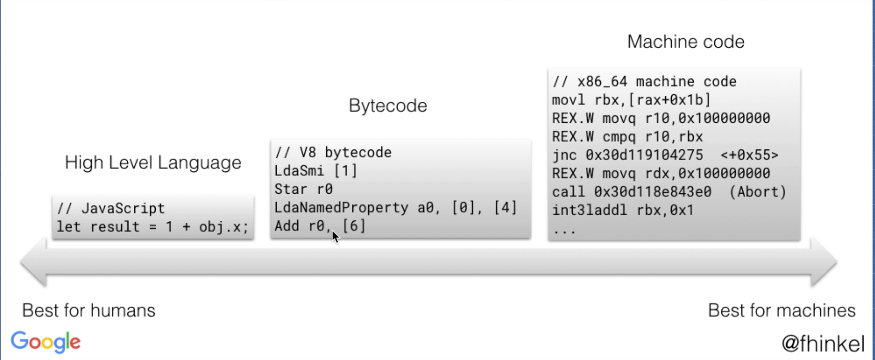

- **Singleton**

  - Restrict the instantiation of a class to one "single" instance ([see the wiki article](https://en.wikipedia.org/wiki/Singleton_pattern))

  - This is useful when exactly one object is needed to coordinate actions across the system.

- `debounce`:

  - it limits the rate at which a function can fire
  - In `redux-saga` is non-blocking.

- **idempotent**: When applying a function multiple times, the state won't change after applying it the first time.

  - A function we can retry several times until it works! Yeah!

- **idiomatic**: Idiomatic in the context of programming can usually be defined as "the most natural way to express something in a language"

- **imperative** vs. **declarative**

  See [the article which compares imperative vs. declarative](./imperative-declerative.md)

## literal vs statement vs expression

### literals

Representing a value within source code.

- `"foo"` (a string)
- `true` (a boolean)
- ...

Not **literals**:

  - `std::cout` (an identifier - refer to a value in memory)
  - `foo = 0;` (a statement)
  - `1+2` (an expression)

[Taken from this SO answer](https://stackoverflow.com/a/485161).

### Statement vs. Expression

#### Examples

##### Expressions

- `yield*` is an **expression**, not a **statement** — so it evaluates to a value.

- In the [haskell article](../haskell/haskell.md) I read the following line:
  > Haskell’s `if` is an *expression* that must return a value, and not a *statement*.

##### Statements

**JavaScript**

- `if`/`else` clause and `switch`/`case`
- `return`
- `import` and `export`
- `with`

See [this article from Axel Rauschmayer](https://2ality.com/2012/09/expressions-vs-statements.html) for more details.

## Compiled vs. transpiled

- [Great article](https://medium.com/@allansendagi/inside-the-javascript-engine-compiler-and-interpreter-c8faa638b0d9)