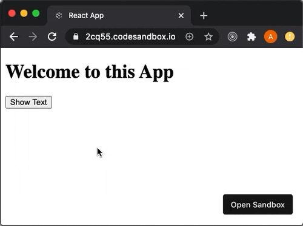
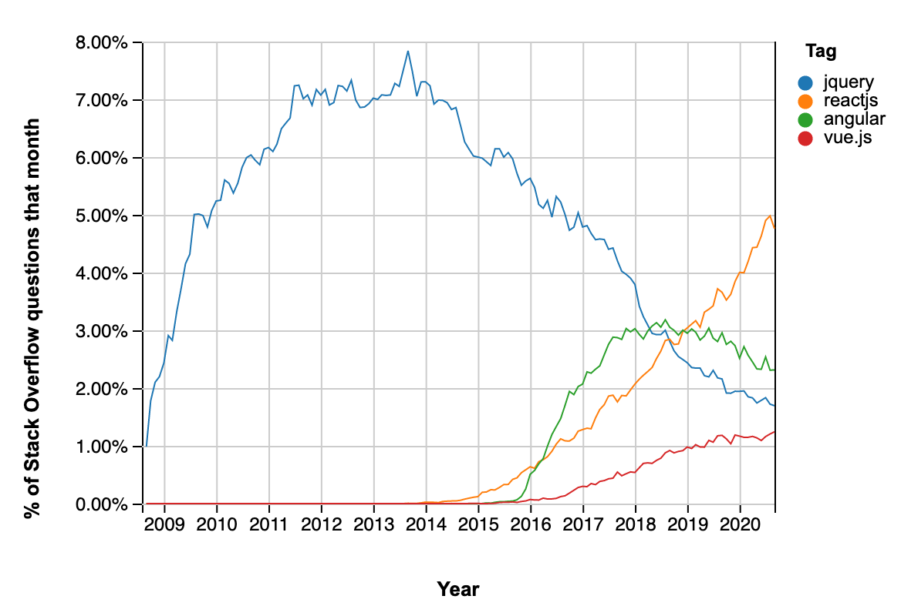

## Why is React called "declarative"?

Many articles, tutorials, docs and books talk about **imperative** or **declarative** ways of doing things. APIs are designed in one way or the other. But what does that actually mean?

In this article I contrast React's **declarative** approach with jQueries **imperative** approach, thereby explaining what **declarative** and **imperative** actually mean in this context.

At last I give an example of how the most popular routing library for React Native `react-navigation` moved from an imperative api to a declarative api to foster our understanding of the terms.

**Table of contents**:

+ [Why is React called "declarative"?](#why-is-react-called-declarative)
+ [Definitions](#definitions)
+ [Code comparison: Rendering](#code-comparison-rendering)
  + [Imperative (jQuery)](#imperative-jquery)
    + [Alternative (more "imperative") solution](#alternative-more-imperative-solution)
    + [Declarative (React)](#declarative-react)
+ [Verdict: **imperative** vs. **declarative**](#verdict-imperative-vs-declarative)
  + [Imperative (jQuery)](#imperative-jquery-1)
  + [Declarative (React)](#declarative-react-1)
  + [Every computer eventually needs **imperative** commands](#every-computer-eventually-needs-imperative-commands)
+ [React Native example: `react-navigation`](#react-native-example-react-navigation)
  + [**Imperative** version `4`](#imperative-version-4)
  + [**Declarative** version `5`](#declarative-version-5)
+ [Further reading](#further-reading)

## Definitions

- **Imperative**: Give step-by-step instructions on **how** to reach a certain goal.
- **Declarative**: Describing the result (the **what**), without instructing **how** to do it.

Non-code **example**:

- Mom wants a kid to tidy up its room.

  - **Imperative**: "Pick up the toys, then empty the bin, then remove dust and finally vacuum the floor."
  - **Declarative**: "Here's a picture of how your room looks like clean. I want you to get it into that state in 30 minutes."

  <p align="center">
      
  </p>
  <div style="color: #484848; text-align: center; font-size: 0.6rem;">
    <span>Photo by <a href="https://unsplash.com/@igorstarkoff?utm_source=unsplash&amp;utm_medium=referral&amp;utm_content=creditCopyText">Igor Starkov</a> on <a href="https://unsplash.com/s/photos/kids-room?utm_source=unsplash&amp;utm_medium=referral&amp;utm_content=creditCopyText">Unsplash</a>
    </span>
  </div>

## Code comparison: Rendering

After looking at code examples we'll define the terms more carefully. But let's first jump into code.

How are html elements conditionally rendered in the browser?

In other words: Given a condition (for example "button has been pressed"), render or don't render a certain html element (i.e. a paragraph containing the string "Hello World": `<p>Hello World</p>`). That's how our app looks like:

<p align="center">
  
</p>
<div style="color: #484848; text-align: center; font-size: 0.6rem;">
  <span>The simple app to illustrate the point of this article.
  </span>
</div>

Let's take a look at an **imperative** way and a **declarative** way of implementing it:

### Imperative (jQuery)

[jQuery](https://jquery.com/) was the most popular JavaScript library (with its peak popularity between 2011 and 2015) as can be inferred from [StackOverFlow question trends](https://insights.stackoverflow.com/trends?tags=jquery%2Creactjs) which shows that until mid-2018 more questions were asked about jQuery than for React:

<p align="center">
  
</p>
<div style="color: #484848; text-align: center; font-size: 0.6rem;">
  <span>The amount of questions asked concerning the technologies <b>jQuery</b>, <b>React</b>, <b>Angular</b> and <b>Vue</b>. Created with the <a href="https://insights.stackoverflow.com/trends?tags=jquery%2Creactjs%2Cangular%2Cvue.js">Stack OverFlow Trends</a> tool.
  </span>
</div>

jQuery follows an **imperative** approach when it comes to manipulating whatever is displayed in an html user interface.

The html code of the user interface you saw in the above gif is very simple.

```html
<body>
  <h1>Welcome to this App</h1>
  <button>Show Text</button>
</body>
```

After clicking on the button, the html body looks like this (line `4` got added):

```html {4}
<body>
  <h1>Welcome to this App</h1>
  <button>Show Text</button>
  <p>Hello World</p>
</body>
```

We've got some interactivity here so we need to add some JavaScript code to control our html markup. This is how it can be achieved with the JavaScript framework **jQuery**:

1. Hide paragraph from the rendered DOM:

    The `p` tag which should only be visible after clicking on the button is hidden with the CSS rule `display: none;`:

    ```html
    <body>
      <h1>Welcome to this App</h1>
      <button>Show Text</button>
      <p style="display: none;">Hello World</p>
    </body>
    ```

    **Note**: As compared to the CSS rule `opacity: 0;`, `display: none;` makes sure the element is not at all in the DOM and does not take up any screen space.

2. Add JavaScript instructions of actions to take so that `p` is displayed right after the user pressed the button.

    In this case there's only one action to take/instruction to give (i.e. `$('p').show();`) if the button was clicked (`$` defines/accesses **jQuery**):

    ```js
    $('button').click(() => {
      $('p').show();
    });
    ```

3. We add the JavaScript code as a `script` to the `html` code which gives us:

    ```html:title=index.html
    <!DOCTYPE html>
    <html>
      <head>
        <script src="https://code.jquery.com/jquery-3.5.0.js"></script>
      </head>
      <body>
        <h1>Welcome to this App</h1>
        <button>Show Text</button>
        <p style="display: none;">Hello World</p>

        <script>
          $('button').click(() => {
            $('p').show();
          });
        </script>
      </body>
    </html>
    ```

    - Play around with the code in [this CodeSandBox](https://codesandbox.io/s/jquery-show-imperative-ebwei).

#### Alternative (more "imperative") solution

To more clearly showcase the imperative nature used in **jQuery**, let's look at this other solution.

1. We start with the original html code:

    ```html
    <body>
      <h1>Welcome to this App</h1>
      <button>Show Text</button>
    </body>
    ```

2. We add an `onclick` handler with a callback function (called `appendText`) to the `button`:

    ```html {3}
    <body>
      <h1>Welcome to this App</h1>
      <button onclick="appendText()">Show Text</button>
    </body>
    ```

    **Note**: The `<p>Hello World</p>` line is not even present here.

3. Implementing the `appendText` callback function

    - We create a `p` element and fill it with the string **"Hello World"**:

        ```js
        var txt = document.createElement('p');
        txt.innerHTML = 'Hello World'; // Create text with DOM
        ```

    - With `$('body')` we get hold of the html `body` DOM element and can `append` an element as it's last child.

        ```js
          var txt = document.createElement('p');
          txt.innerHTML = 'Hello World'; // Create text with DOM
          $('body').append(txt); // Append new element
        ```

        **Note**: This is a list of three imperative steps!

    - We encapsulate this logic into the `appendText` function:

        ```js
        function appendText() {
          var txt = document.createElement('p');
          txt.innerHTML = 'Hello World'; // Create text with DOM
          $('body').append(txt); // Append new element
        }
        ```

4. Combining JavaScript `script` and the `html` code we get the following `index.html` file:

    ```html:title=index.html
    <!DOCTYPE html>
    <html>
      <head>
        <script src="https://code.jquery.com/jquery-3.5.0.js"></script>
        <script>
          function appendText() {
            var txt = document.createElement("p");
            txt.innerHTML = "Hello World"; // Create text with DOM
            $("body").append(txt); // Append new element
          }
        </script>
      </head>
      <body>
        <h1>Welcome to this App</h1>
        <button onclick="appendText()">Show Text</button>
      </body>
    </html>
    ```

    - Play around with the code in [this CodeSandBox](https://codesandbox.io/s/jquery-append-imperative-jcy3l).

#### Declarative (React)

Let's create the same UI with **React** which uses a declarative approach:

1. With **React** the `html` markup is modeled via a **virtual DOM** written in JavaScript.

    The following `h1` and `button` elements are not html elements but React elements (written in [JSX](https://reactjs.org/docs/introducing-jsx.html)):

    ```jsx:title=JavaScript
    <h1>Welcome to this App</h1>
    <button onClick={() => setDidPressButton(true)}>Show Text</button>
    {didPressButton ? <p>Hello World</p> : null}
    ```

2. The `p` element which will only appear after the button was pressed is added as such:

    ```jsx:title=JavaScript {3}
    <h1>Welcome to this App</h1>
    <button onClick={() => setDidPressButton(true)}>Show Text</button>
    {didPressButton ? <p>Hello World</p> : null}
    ```

    - Line `3` describes **how** the DOM will look like given one of two **states**.
    - More precisely line `3` uses the [conditional ternary operator](https://developer.mozilla.org/en-US/docs/Web/JavaScript/Reference/Operators/Conditional_Operator) to render `<p>Hello World</p>` if the button was pressed, but `null` (i.e. nothing) if the button wasn't yet pressed.
    - Thanks to **React** there is no separation between `html` markup and `JavaScript` logic anymore.

3. We still need to add logic so that the `didPressButton` variable gets the right value assigned:

    To this end we add the `didPressButton` local state with the `useState` hook in line `4` and set the value to `true` when the button is pressed in line `8`:

    ```jsx:title=App.js {4,8}
    import React, { useState } from 'react';

    const App = () => {
      const [didPressButton, setDidPressButton] = useState(false);
      return (
        <div className="App">
          <h1>Welcome to this App</h1>
          <button onClick={() => setDidPressButton(true)}>Show Text</button>
          {didPressButton ? <p>Hello World</p> : null}
        </div>
      );
    };

    export default App;
    ```

    - Play around with the code in [this CodeSandBox](https://codesandbox.io/s/react-declarative-2cq55).

## Verdict: **imperative** vs. **declarative**

### Imperative (jQuery)

- The second jQuery example contains step-by-step instructions on **how** to reach a certain goal which makes it **imperative**:

   ```js
   function appendText() {
     var txt = document.createElement('p');
     txt.innerHTML = 'Hello World'; // Create text with DOM
     $('body').append(txt); // Append new element
   }
   ```

- Such step-by-step instructions might seem **more straightforward** than a `conditional ternary operator` plus a `useState hook` as used in **React**.

- **BUT** it's **difficult to reason about the code**!

   The html markup is the following:

   ```html
   <body>
     <h1>Welcome to this App</h1>
     <button onclick="appendText()">Show Text</button>
   </body>
   ```

   **Problem**:

   - This does not give any indication of a third element which is conditionally added to the DOM!
   - How does the DOM look like given a certain state? Difficult to say because JavaScript instructions are separated from the description of the DOM (the app's structure described using `html` code)
   - **Verdict**: Code which is hard to grasp.

### Declarative (React)

- You describe the **what**, without instructing **how** to do it.

    ```jsx:title=JavaScript
    <div className="App">
      <h1>Welcome to this App</h1>
      <button onClick={() => setDidPressButton(true)}>Show Text</button>
      {didPressButton ? <p>Hello World</p> : null}
    </div>
    ```

- The structure of the app is described in front of you.
- No instructions on how to manipulate the DOM must be given. Instead React automatically triggers an update of the DOM when the value of `didPressButton` changes.
- How are the DOM updates realized? - That's hidden behind the curtains of React.
- **Verdict**: Safer and easier to extend.

### Every computer eventually needs **imperative** commands

The computer eventually needs a sequence of imperative commands. The programming language or framework just hides it from the developer.

That's what [React's virtual DOM](https://nebulab.it/blog/virtual-dom/) does. It creates a new copy of a virtual DOM tree (created from the JSX code) every time something changes. It compares this new virtual DOM tree with the one from before and mutates the parts of the browser's DOM which actually changed.

## React Native example: `react-navigation`

The most popular navigation library of React Native [react-navigation](https://reactnavigation.org/) moved from an **imperative** approach (version `4`) to a **declarative** approach (version `5`).

Let's look at the example of an authentication-flow. For the following examples, the login/logout status is stored in a globally accessible state variable named `isLoggedIn`.

### **Imperative** version `4`

- Given a certain login/logout status or event you imperatively instruct the app to navigate to certain screens.

    - When a user opens the mobile app, you check the login status (which is stored in the global state variable `isLoggedIn`). If the user is logged in, you navigate to the Home screen and if the user is not logged in, you navigate to the Login screen:

        ```js
        const onStartup = () => {
          if (isLoggedIn) {
            navigation.navigate('Home');
          } else {
            navigation.navigate('Login');
          }
        }
        ```

    - When a user logs out you again imperatively instruct the app to go back to the login screen:

        ```js
        const onLogout = () => {
          navigation.navigate('Login');
        }
        ```

    - **Cumbersome and error-prone**: You have to manually implement all the navigation changes which are triggered by the login state changes.

### **Declarative** version `5`

- You declare which Screen (`Login` or `Home`) is shown dependent on the global login **state** (stored in the global state variable `isLoggedIn`) of your app (using the `conditional ternary operator`):

    ```jsx
    <Stack.Navigator>
      {isLoggedIn ? (
        <>
          <Stack.Screen name="Home" component={HomeScreen} />
          <Stack.Screen name="Settings" component={SettingsScreen} />
        </>
      ) : (
        <Stack.Screen name="Login" component={LoginScreen} />
      )}
    </Stack.Navigator>
    ```

- **Easy to reason about**: You don't have to imperatively instruct any navigation change in code. The declarative description makes sure that the correct screen will be shown depending on the

## Further reading

I hope you now have a better grasp about the difference between **imperative** or **declarative** programming approaches. I struggled for quite a while to really understand their differences.

If you want to read more, I can recommend the following articles which helped me while writing this article:

- [Imperative vs. declarative - Pros and Cons](https://www.netguru.com/blog/imperative-vs-declarative).
- [Is jQuery imperative?](https://www.reddit.com/r/javascript/comments/4kim6p/is_jquery_imperative/)
- [Complete guide to declarative programming](https://www.capitalone.com/tech/cloud/declarative-programming-guide/)