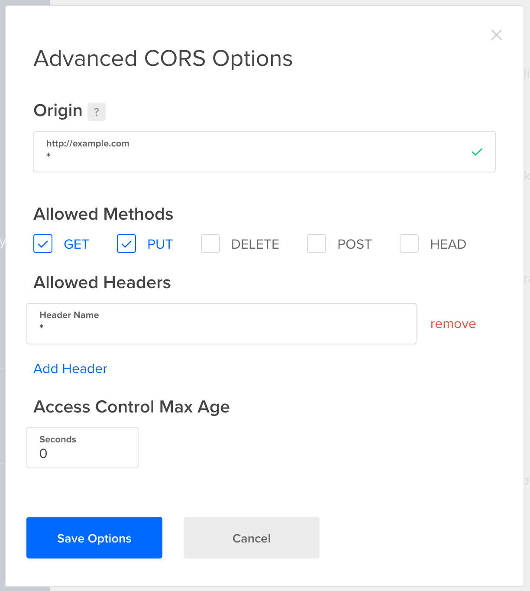

## CORS

### Request headers

When sending an HTTP request you can add headers to pass additional information to the server with an HTTP request.

> [Request headers](https://developer.mozilla.org/en-US/docs/Glossary/Request_header) contain more information about the resource to be fetched, or about the client requesting the resource. (taken from [here](https://developer.mozilla.org/en-US/docs/Web/HTTP/Headers))

**Example**:

- > The `Accept-*` headers indicate the allowed and preferred formats of the response (taken from [here](https://developer.mozilla.org/en-US/docs/Glossary/Request_header))
-

## Security reason: Cross-site request forgery

- see https://cheatsheetseries.owasp.org/cheatsheets/Cross-Site_Request_Forgery_Prevention_Cheat_Sheet.html#token-based-mitigation
- TODO: Read Eli5 https://www.reddit.com/r/explainlikeimfive/comments/wayk3/eli5_cross_site_request_forgery_csrf/

## Same-origin security policy

For security reasons, browsers restrict cross-origin HTTP requests initiated from scripts.

> A web application using those APIs can only request resources from the same origin the application was loaded from unless the response from other origins includes the right CORS headers.

> Modern browsers handle the client side of cross-origin sharing, including headers and policy enforcement. But the CORS standard means servers have to handle new request and response headers.

(all taken from [here](https://developer.mozilla.org/en-US/docs/Web/HTTP/CORS))

> Cross-origin writes are typically allowed (taken from [here](https://developer.mozilla.org/en-US/docs/Web/Security/Same-origin_policy)).

## How to set up CORS

> Client web applications loaded in one domain can interact with resources in a AWS S3 Bucket/Digital Ocean Space with **Cross-Origin Resource Sharing** (`CORS`) configured.

It's about this [HTTP request header](https://developer.mozilla.org/en-US/docs/Web/HTTP/Headers) field:

- **Web-App**: The [Access-Control-Allow-Origin](https://developer.mozilla.org/en-US/docs/Web/HTTP/Headers/Access-Control-Allow-Origin) response header indicates whether the response can be shared.

    During development (before the app goes life) you need a bit more open as you're operating from a local machine. Thus, cross origin requests should be possible from every origin (`*`):

    ```js
    "Access-Control-Allow-Origin": "*",
    ```

    In the best case we limit it to only the hostname of the application, so only requests with this origin can upload files:

    ```js
    "Access-Control-Allow-Origin": "https://app.myHomepage.org",
    ```

    This assures that only requests which come from `https://app.myHomepage.org` and go directly to the server from there are treated.

- **Server Configuration**: Set the origin (domain) from which requests to the resource are allowed:

  - **Unsafe**: Allow all origins with any kind of header:

    


### Example

1. File upload page is hosted on <https://app.myHomepage.org/upload>
2. The login request includes the following header:

    ```js
    "Access-Control-Allow-Origin": "https://app.myHomepage.org",
    ```

3. The file-upload server has the following list of allowed origins configured:

    ```
    https://app.myHomepage.org
    https://v1.myHomepage.org
    https://v2.myHomepage.org
    ```

4. Congrats! It will work because two things match!

    1. The value set for `Access-Control-Allow-Origin` matches the origin of the request
    2. The value set in `Access-Control-Allow-Origin` is included in the list of allowed domains.

## Postman & CORS

> Postman simply doesn't care about CORS headers. So CORS is just a browser concept and not a strong security mechanism. It allows you to restrict which other web apps may use your backend resources but that's all.

Taken from [Understanding CORS](https://academind.com/tutorials/cross-site-resource-sharing-cors/) article.
